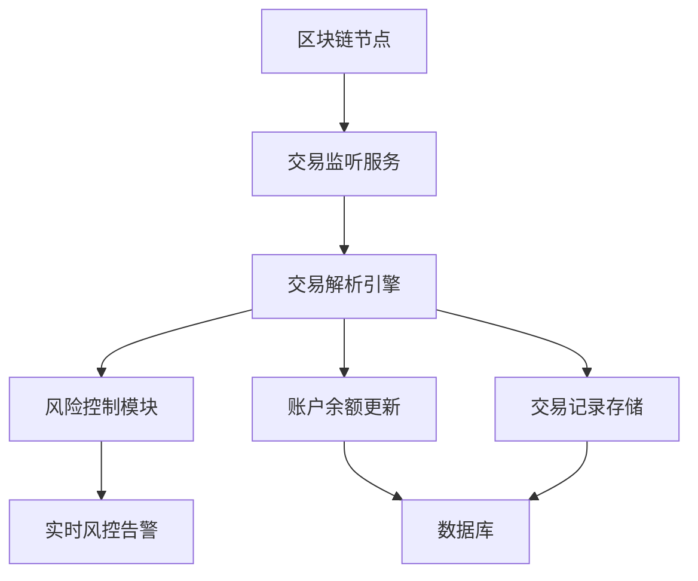
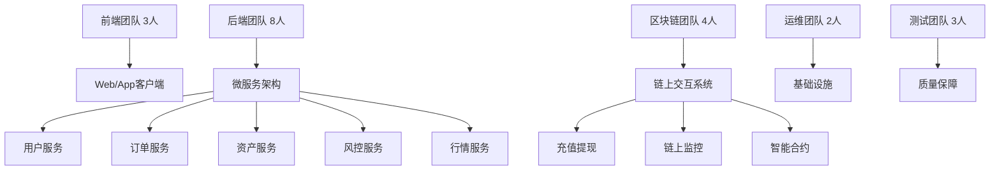

### Web3相关

#### (一) 概念

1、什么是智能合约?智能合约是一种基于区块链技术的可编程代码，用于执行合约中规定的操作。智能合约可以自动执行、管理、调解合约中的交易，无需第三方介入，确保交易的安全性和可靠性。

#### 2、什么是公链和代币?

公链:公链是一种开放的区块链网络，任何人都可以加入并参与网络的维护和管理比特币和以太坊是两个常见的公链项目。

代币:代币是在区块链网络上发行的数字资产，可以代表实物资产、权益或货币等代币可以在区块链网络上进行转账、交易和存储。

#### 3、NFT(非同质化代币)的发展与应用

NFT是非同质化代币(Non-Fungible Token)的简称，是一种基于区块链技术的数字资产，每个 NFT都具有独特的标识和价值。NFT的兴起使得数字艺术、游戏道具、虚拟地产等数字内容可以被唯一标识、交易和转让，为数字资产注入了独特的价值。

#### 4、去中心化金融(DeFi)的发展与应用

去中心化金融(DeFi)是基于区块链技术构建的金融系统，去除了传统金融中心化的中介机构，实现了更加公平、透明和高效的金融服务。DeFi包括借贷、交易、稳定币、流动性挖矿等多种金融服务，为全球用户提供了更加开放和自由的金融体验。

#### 5、Web3.0 的概念与发展

Web3.0是互联网的下一代演进，是建立在区块链技术基础上的新一代互联网。与传统的 Web2.0相比，Web3.0 更加去中心化、安全、透明和开放，为用户提供了更加私密和自主的在线体验，实现了数据的真正所有权和价值交换。

#### 6、DAO(去中心化自治组织)的兴起与应用

DAO(Decentralized Autonomous Organization)是一种基于区块链技术的组织形式，由智能合约自动执行，没有中心化的管理机构。DA0 的成员可以通过投票决定组织的运营、资金分配、治理规则等事项，实现了组织的去中心化自治和民主治理。

# 前端面试题

我来为你整理这些前端面试题的详细答案和解析，帮助你更好地准备面试。

## 1. SSR QPS（服务器端渲染的每秒查询率）

**答案：**
SSR QPS 指服务器端渲染应用每秒能处理的请求数量，是衡量 SSR 应用性能的关键指标。

**解析：**
- **影响因素**：服务器性能、缓存策略、代码优化程度、并发处理能力
- **优化方案**：
  - 使用缓存（页面级缓存、组件级缓存）
  - 代码分割和懒加载
  - 启用 Gzip 压缩
  - CDN 加速静态资源
  - 数据库查询优化
- **监控工具**：LoadRunner、JMeter、WebLOAD

## 2. WebSocket 协议

**答案：**
WebSocket 是全双工通信协议，通过单个 TCP 连接提供持久性的实时通信。

**解析：**
- **特点**：
  - 双向实时通信
  - 低延迟，头部数据小
  - 保持连接状态
- **建立过程**：HTTP 协议升级握手（101 Switching Protocols）
- **核心API**：
  ```javascript
  const ws = new WebSocket('ws://example.com');
  ws.onopen = () => { /* 连接建立 */ };
  ws.onmessage = (event) => { /* 接收数据 */ };
  ws.send('Hello Server');
  ws.close();
  ```
- **适用场景**：实时聊天、在线游戏、实时数据推送

## 3. JS 精度问题

**答案：**
JavaScript 采用 IEEE 754 标准的 64 位双精度浮点数，导致小数运算可能出现精度误差。

**解析：**
- **问题示例**：`0.1 + 0.2 = 0.30000000000000004`
- **解决方案**：
  - 使用整数运算：`(0.1 * 10 + 0.2 * 10) / 10 = 0.3`
  - 使用第三方库：decimal.js、big.js
  - 四舍五入指定小数位：`Number((0.1 + 0.2).toFixed(1))`
  - 使用 ES6 的 `Number.EPSILON` 进行容差比较

## 4. 前端性能优化（白屏、卡顿）

**答案：**

**白屏优化：**
- 减少关键资源大小（代码分割、Tree Shaking）
- 预加载关键资源（`<link rel="preload">`）
- 服务端渲染或预渲染
- 使用 Loading 动画提升用户体验

**卡顿优化：**
- 减少重绘重排（使用 transform/opacity）
- 防抖节流控制事件频率
- Web Worker 处理复杂计算
- 虚拟列表优化长列表渲染
- 使用 Chrome DevTools Performance 分析性能瓶颈

## 5. TypeScript 中的类型保护和 infer

**答案：**

**类型保护**：在运行时检查类型，缩小类型范围
```typescript
// typeof 类型保护
if (typeof value === 'string') { /* value是string */ }

// instanceof 类型保护
if (error instanceof Error) { /* error是Error实例 */ }

// 自定义类型保护
function isFish(pet: Fish | Bird): pet is Fish {
  return (pet as Fish).swim !== undefined;
}
```

**infer 关键字**：在条件类型中推断类型
```typescript
// 提取函数返回类型
type ReturnType<T> = T extends (...args: any[]) => infer R ? R : any;

// 提取数组元素类型
type ElementType<T> = T extends (infer U)[] ? U : T;
```

## 6. React useEffect

**答案：**
`useEffect` 用于处理函数组件中的副作用操作。

**解析：**
```javascript
useEffect(() => {
  // 副作用逻辑
  return () => {
    // 清理函数（可选）
  };
}, [dependencies]); // 依赖数组
```

**使用场景**：
- 无依赖数组：每次渲染后执行
- 空依赖数组：仅挂载时执行一次
- 有依赖数组：依赖变化时执行

## 7. 自定义 Hook 笔试题示例

**实现一个 useLocalStorage Hook：**
```javascript
import { useState, useEffect } from 'react';

function useLocalStorage(key, initialValue) {
  const [value, setValue] = useState(() => {
    try {
      const item = window.localStorage.getItem(key);
      return item ? JSON.parse(item) : initialValue;
    } catch (error) {
      return initialValue;
    }
  });

  useEffect(() => {
    try {
      window.localStorage.setItem(key, JSON.stringify(value));
    } catch (error) {
      console.error('Error saving to localStorage:', error);
    }
  }, [key, value]);

  return [value, setValue];
}

// 使用示例
const [name, setName] = useLocalStorage('name', 'Guest');
```

## 8. React 架构

**答案：**
React 16+ 采用 Fiber 架构重构，主要特点：

**Fiber 架构核心：**
- 增量渲染：将渲染工作拆分成多个小任务
- 任务优先级：区分高优先级和低优先级更新
- 可中断渲染：允许中断和恢复渲染过程

**现代 React 架构组成：**
- Reconciler（协调器）：计算状态变化
- Renderer（渲染器）：将变化渲染到不同平台
- Scheduler（调度器）：调度任务优先级

## 9. 原型链

**答案：**
JavaScript 通过原型链实现继承机制。

**解析：**
```javascript
function Person(name) {
  this.name = name;
}
Person.prototype.sayHello = function() {
  console.log(`Hello, I'm ${this.name}`);
};

function Student(name, grade) {
  Person.call(this, name);
  this.grade = grade;
}
Student.prototype = Object.create(Person.prototype);
Student.prototype.constructor = Student;

const student = new Student('Alice', 'A');
student.sayHello(); // 通过原型链访问Person的方法
```

**原型链查找机制**：`student → Student.prototype → Person.prototype → Object.prototype → null`

## 10. Cookie、XSS、CSRF

**答案：**

**Cookie**：
- HTTP 状态管理机制
- 属性：Domain、Path、Expires/Max-Age、HttpOnly、Secure、SameSite

**XSS（跨站脚本攻击）**：
- **类型**：存储型、反射型、DOM型
- **防御**：
  - 输入输出转义（`<` → `&lt;`）
  - CSP（内容安全策略）
  - 使用 HttpOnly Cookie

**CSRF（跨站请求伪造）**：
- **防御措施**：
  - SameSite Cookie
  - CSRF Token 验证
  - 验证 Referer/Origin 头

## 11. 开发质量及工作流程主观题

**答案要点：**

**代码质量保障：**
- 代码规范（ESLint、Prettier）
- 单元测试（Jest、Testing Library）
- 代码审查流程
- TypeScript 类型检查

**工作流程优化：**
- Git 分支策略（Git Flow）
- CI/CD 自动化流程
- 自动化测试部署
- 监控和错误追踪（Sentry）

**团队协作：**
- 清晰的文档规范
- 定期的技术分享
- 代码重构和技术债务管理
- 性能监控和优化循环


我来为你详细解答这些前端面试题，帮助你更好地准备面试。

## 1. Vue 中插槽实现原理

**答案：**
Vue 的插槽（Slot）是一种内容分发机制，允许父组件向子组件传递模板内容。

**解析：**
- **编译阶段**：Vue 编译器将插槽内容编译为函数，保存在 `$slots` 或 `$scopedSlots` 中
- **渲染阶段**：子组件通过 `<slot>` 标签调用对应的插槽函数来渲染内容
- **作用域插槽**：父组件可以通过插槽访问子组件的数据
- **实现原理**：
  ```javascript
  // 编译后的插槽函数
  const slots = {
    default: () => [h('div', '默认内容')],
    header: () => [h('h1', '标题')]
  }
  ```

## 2. Web Worker 怎么使用

**答案：**
Web Worker 允许在后台线程运行 JavaScript 代码，避免阻塞主线程。

**解析：**
```javascript
// 主线程
const worker = new Worker('worker.js');
worker.postMessage('Hello Worker');
worker.onmessage = (event) => {
  console.log('来自Worker:', event.data);
};

// worker.js
self.onmessage = (event) => {
  const result = doHeavyCalculation(event.data);
  self.postMessage(result);
};
```

**使用场景**：复杂计算、大数据处理、图像处理等耗时操作。

## 3. Vue3 和 Vue2 的区别

**答案：**

| 特性                | Vue2                  | Vue3                           |
| ------------------- | --------------------- | ------------------------------ |
| **响应式系统**      | Object.defineProperty | Proxy                          |
| **性能**            | 较差                  | 更好的tree-shaking，更小包体积 |
| **Composition API** | 无                    | 有（setup函数）                |
| **TypeScript**      | 支持一般              | 更好的TS支持                   |
| **Fragment**        | 不支持                | 支持多根节点                   |
| **生命周期**        | options API           | composition API生命周期钩子    |

## 4. React 和 Vue 的区别

**答案：**

| 方面         | React               | Vue                  |
| ------------ | ------------------- | -------------------- |
| **设计理念** | 函数式编程          | 响应式编程           |
| **数据流**   | 单向数据流          | 双向数据绑定（可选） |
| **模板语法** | JSX                 | 模板语法             |
| **状态管理** | useState/useReducer | data() + reactive    |
| **学习曲线** | 较陡峭              | 较平缓               |
| **生态系统** | 更丰富              | 更集成               |

## 5. SVN 怎么用的

**答案：**
SVN（Subversion）是集中式版本控制系统。

**基本命令：**
```bash
# 检出代码
svn checkout http://svn.example.com/project/trunk

# 更新代码
svn update

# 添加文件
svn add filename

# 提交更改
svn commit -m "提交说明"

# 查看状态
svn status

# 查看日志
svn log
```

## 6. 手写防抖和节流

**防抖（Debounce）：**
```javascript
function debounce(func, delay) {
  let timeoutId;
  return function(...args) {
    clearTimeout(timeoutId);
    timeoutId = setTimeout(() => {
      func.apply(this, args);
    }, delay);
  };
}
```

**节流（Throttle）：**
```javascript
function throttle(func, delay) {
  let lastCall = 0;
  return function(...args) {
    const now = Date.now();
    if (now - lastCall >= delay) {
      lastCall = now;
      func.apply(this, args);
    }
  };
}
```

## 7. TradingView 使用和功能

**答案：**
TradingView 是专业的金融图表库。

**主要功能：**
- K线图、技术指标、绘图工具
- 多种图表类型（蜡烛图、线图、柱状图）
- 技术分析工具（趋势线、斐波那契）
- 时间周期切换
- 跨设备同步

**基本使用：**
```javascript
new TradingView.widget({
  symbol: 'BINANCE:BTCUSDT',
  interval: '1D',
  container_id: 'chart',
  library_path: '/charting_library/',
  locale: 'zh'
});
```

## 8. Vue 和 React 的 Diff 算法区别

**答案：**

**Vue Diff：**
- 双端比较（头头、尾尾、头尾、尾头）
- 使用key优化
- 更注重顺序变化

**React Diff：**
- 分层比较（只比较同一层级）
- 使用key标识元素
- 更注重元素类型变化

## 9. Webpack 构建流程

**答案：**
1. **初始化**：读取配置，创建Compiler对象
2. **编译**：从入口开始，递归构建依赖图
3. **模块处理**：使用loader转换模块
4. **依赖解析**：解析模块间的依赖关系
5. **打包**：将模块组合成chunk
6. **输出**：将chunk写入文件系统

## 10. 线程和进程的区别

**答案：**

| 方面         | 进程                   | 线程                         |
| ------------ | ---------------------- | ---------------------------- |
| **资源占用** | 独立内存空间           | 共享进程内存                 |
| **创建开销** | 大                     | 小                           |
| **通信方式** | IPC（进程间通信）      | 共享内存                     |
| **稳定性**   | 一个进程崩溃不影响其他 | 一个线程崩溃导致整个进程崩溃 |

## 11. Next.js Pages Router 和 App Router 的区别

**答案：**

**Pages Router（传统）：**
- 基于文件系统的路由
- `pages` 目录结构决定路由
- 简单的页面级路由

**App Router（App Router）：**
- 基于 `app` 目录的新路由系统
- 支持布局、嵌套路由、加载状态
- 更好的数据获取和缓存

## 12. CSS 实现同心圆彩虹色

**答案：**
```css
.rainbow-circle {
  width: 200px;
  height: 200px;
  border-radius: 50%;
  background: conic-gradient(
    red, orange, yellow, green, blue, indigo, violet, red
  );
  position: relative;
}

.rainbow-circle::after {
  content: '';
  position: absolute;
  top: 20px;
  left: 20px;
  width: 160px;
  height: 160px;
  border-radius: 50%;
  background: white;
}
```

## 13. DDoS 攻击防御

**答案：**
- **流量清洗**：使用CDN或云防护服务
- **限流策略**：限制单个IP的请求频率
- **Web应用防火墙**：识别和过滤恶意流量
- **负载均衡**：分散流量到多个服务器
- **隐藏真实IP**：使用CDN或反向代理

## 14. 领导力问题：下属不听话怎么办

**答案：**
1. **沟通理解**：了解对方不配合的原因
2. **解释原因**：说明修改的必要性和价值
3. **给予支持**：提供必要的资源和支持
4. **寻求共识**：共同讨论更好的解决方案
5. **明确责任**：如果持续不配合，按公司流程处理

## 15. 钱包前端存储安全

**答案：**
- **敏感信息**：私钥、助记词永远不存储在前端
- **可存储信息**：加密后的数据、用户偏好设置
- **存储方式**：使用安全的存储机制（HttpOnly Cookie、Secure LocalStorage）
- **Go Sleep**：可能是笔误，可能指"Graceful Shutdown"（优雅关闭）

## 16. K线图实现方案

**答案：**
- **技术选型**：TradingView、ECharts、Lightweight Charts
- **数据流**：WebSocket 实时数据 + RESTful API 历史数据
- **性能优化**：数据分页、虚拟渲染、Canvas渲染
- **功能实现**：技术指标、绘图工具、时间周期切换

## 17. 移动端开发和虚拟化钱包

**答案：**
- **移动端技术**：React Native、Flutter、原生开发
- **虚拟化钱包**：指基于软件的钱包解决方案
- **安全考虑**：硬件加密、安全 enclave、生物识别
- **MPC技术**：多方计算，分散私钥管理风险

## 18. Chrome 插件开发

**答案：**
- **manifest.json**：配置文件
- **content scripts**：页面注入脚本
- **background scripts**：后台运行脚本
- **popup**：弹出界面
- **API权限**：声明需要的Chrome API权限

```json
{
  "manifest_version": 3,
  "name": "My Extension",
  "version": "1.0",
  "permissions": ["activeTab", "storage"]
}
```

---

这些答案涵盖了各个公司的面试题，希望对你有所帮助！记得根据实际经验个性化你的回答。

# Tomo面经面试题


## 1. 智能合约升级方式及区别

**答案：**

### 1. 代理模式 (Proxy Pattern) - 最常用

**核心思想**：使用代理合约来转发调用到实现合约，存储和逻辑分离。

### 2. 数据分离模式 (Data Separation)

**核心思想**：将存储合约和逻辑合约完全分离。

### 3. 钻石模式 (Diamond Pattern) - EIP-2535

**核心思想**：一个代理合约可以路由到多个实现合约（facet）。

**三种主要升级方式：**

| 方式         | 原理                     | 优点               | 缺点                 |
| ------------ | ------------------------ | ------------------ | -------------------- |
| **代理模式** | 使用代理合约指向逻辑合约 | 状态保持，无缝升级 | 复杂，有存储冲突风险 |
| **数据分离** | 逻辑合约与数据合约分离   | 升级灵活，安全性高 | 开发复杂，gas成本高  |
| **合约迁移** | 部署新合约，迁移数据     | 简单直接           | 需要用户操作，体验差 |

上面是模式，下面是具体的常见技术实现手段。

### 1. 代理委托 (Proxy Delegate) - 最主流

这就是上述**数据分离模式**的具体实现。主要有以下几种流行的实现标准：

- **通用实现**：手动实现`delegatecall`和回退函数。
  - 代理合约有一个`implementation`地址变量。
  - 当调用代理合约的函数不存在时，会触发`fallback`函数，在其中用`delegatecall`调用`implementation`地址的合约。
- **OpenZeppelin 标准库**：提供了经过审计的模板，大大降低了风险。
  - **Transparent Proxy**：通过管理员和普通用户的路由逻辑来防止函数选择器冲突。
  - **UUPS Proxy**：将升级逻辑本身放在了逻辑合约中，而不是代理合约中。这使得代理合约更轻量，gas成本更低。但要求逻辑合约开发者自己负责实现升级功能。
  - **Beacon Proxy**：通过一个“信标”合约来管理逻辑合约地址。多个代理合约都指向这个信标。只需更新信标合约中的逻辑地址，所有代理合约的行为都会一起改变。适用于需要批量升级多个代理合约的场景（如NFT的每个系列一个代理合约）。

### 2. 合约注册表 (Contract Registry)

这就是上述**功能模式**的具体实现。

- 有一个明确的注册表合约，存储最新版本合约的地址。
- 前端或用户先从注册表获取最新逻辑合约的地址，然后再与之交互。
- 或者，由一个路由器合约自动完成查询和转发的步骤。

### 3. 钻石标准实现 (Diamond Implementation)

这就是**钻石标准**的具体实现。

- 需要按照EIP-2535的标准来实现`diamondCut`函数和Loupe（查询）函数。
- 通常使用像`forge-std`或`hardhat-diamond-abi`这样的工具来帮助管理和生成ABI。


## 2. Uniswap V2 机制

**答案：**

**AMM做市机制：**
- **恒定乘积公式**：x * y = k
- **流动性计算**：L = √(x * y)
- **价格计算**：price = y / x

**V2 vs V3 区别：**
- **V2**：全价格区间流动性，资本效率低
- **V3**：集中流动性，资本效率高，但更复杂

## 3. Uniswap V2 核心合约

**答案：**

- **Factory**：创建和管理交易对
- **Pair**：具体的交易对合约，实现AMM逻辑
- **Router**：用户交互接口，提供交易功能

## 4. Solidity 结构体优化

**答案：**

**优化技巧：**
```solidity
// 优化前（浪费存储空间）
struct User {
    uint256 id;       // 32 bytes
    bool isActive;    // 1 byte (但占用32 bytes)
    address wallet;   // 20 bytes
}

// 优化后（打包存储）
struct OptimizedUser {
    uint248 id;       // 31 bytes
    bool isActive;    // 1 byte (与id打包)
    address wallet;   // 20 bytes
}
```

## 5. 闪电贷（Flash Loan）

**答案：**

**原理**：在同一交易内借还款项
```solidity
interface IFlashLoan {
    function flashLoan(uint amount) external {
        // 1. 检查余额
        // 2. 执行用户操作
        // 3. 检查还款
    }
}
```

## 6. ERC721 vs ERC1155

**答案：**

| 特性         | ERC721       | ERC1155            |
| ------------ | ------------ | ------------------ |
| **标准**     | 非同质化代币 | 多代币标准         |
| **批量传输** | 不支持       | 支持               |
| **Gas效率**  | 低           | 高                 |
| **使用场景** | NFT          | 游戏道具、多种资产 |

## 7. ERC20 safeTransferFrom

**答案：**
- 检查接收合约是否实现了ERC20代币接收接口
- 防止代币被锁定在无法处理代币的合约中

## 8. Redis 相关

**内存淘汰策略：**
- **LRU**：最近最少使用（时间维度）
- **LFU**：最不经常使用（频率维度）

**事务机制：**
```bash
MULTI
SET key1 value1
SET key2 value2
EXEC
```

## 9. Redis 限流器设计

**答案：**
```go
func RateLimiter(userID string, limit int, window time.Duration) bool {
    key := "rate_limit:" + userID
    current := redis.INCR(key)
    if current == 1 {
        redis.EXPIRE(key, window)
    }
    return current <= limit
}
```

## 10. Kafka Pull vs Push

**答案：**
- **Pull**：消费者控制节奏，避免 overwhelmed
- **Push**：服务器控制，可能造成消费者压力

## 11. Kafka Partition 分配策略

**答案：**
- Round Robin
- Range
- Sticky

## 12. Golang Defer

**答案：**
```go
func example() {
    defer fmt.Println("1") // 最后执行
    defer fmt.Println("2") // 倒数第二执行
    fmt.Println("3")      // 最先执行
}
// 输出: 3, 2, 1
```

## 13. Defer 底层原理

**答案：**
- 编译器将defer语句转换为运行时调用
- 使用defer链表管理执行顺序
- 在函数返回前执行

## 14. GMP 原理

**答案：**
- **G**：Goroutine（协程）
- **M**：Machine（线程）
- **P**：Processor（处理器）

**调度机制**：P管理G队列，M从P获取G执行

## 15. 协程泄露防治

**答案：**

**泄露场景：**
```go
// channel 阻塞
ch := make(chan int)
go func() {
    <-ch // 永远阻塞
}()

// 防止措施
ctx, cancel := context.WithTimeout(context.Background(), time.Second)
defer cancel()

select {
case <-ch:
    // 正常
case <-ctx.Done():
    // 超时处理
}
```

## 16. Context 用法

**答案：**
```go
// 超时控制
ctx, cancel := context.WithTimeout(context.Background(), 5*time.Second)
defer cancel()

// 取消信号
ctx, cancel := context.WithCancel(context.Background())
go func() {
    time.Sleep(2*time.Second)
    cancel() // 发送取消信号
}()
```

## 17. 出入金系统设计

**答案：**
```go
type PaymentSystem struct {
    redisClient *redis.Client
    ethClient   *ethclient.Client
}

func (ps *PaymentSystem) ProcessDeposit(userID, amount string) {
    // 1. 验证支付
    // 2. 记录订单
    // 3. 发放代币
}

func (ps *PaymentSystem) ProcessWithdrawal(userID, amount string) {
    // 1. 验证余额
    // 2. 调用合约转账
    // 3. 更新状态
}
```

## 18. 基于TG的DApp架构

**答案：**
```
Telegram Bot → Go Backend → Blockchain (EVM)
         ↓
     Tomo Wallet
         ↓
   Redis (缓存)
         ↓
   Kafka (消息队列)
```

# 抹茶面经面试题

好的，这些都是非常核心且常见的Web3面试题。我将为你逐一提供参考答案和解析，帮助你不仅知道答案，更能理解背后的原理，从而在面试中表现出色。

---

## 1. 关于链上数据同步处理的策略

**参考答案：**
处理链上数据同步，我主要会采用一种 **“事件监听 + 异步处理”** 的策略，核心是监听智能合约发出的日志事件（Logs），并将其与前端状态同步。具体策略如下：

1.  **实时监听事件 (Listening)：** 使用 `ethers.js`、`viem` 或 `WebSocket` 提供商订阅智能合约的特定事件（如 `Transfer`, `NewOrder`）。这是获取链上状态变化最实时、最高效的方式。
2.  **获取历史日志 (Fetching Past Events)：** 在应用初始化（如页面加载）时，使用 `queryFilter` 或类似方法获取过去一段时间内的历史事件，用于初始化前端状态，确保数据完整。
3.  **状态更新 (State Update)：** 每当监听到一个新事件，就根据事件中包含的信息（如 `from`, `to`, `tokenId`, `amount` 等）更新前端的本地状态（如 React 的 `useState`、`Zustand` 或 `Redux` store）。
4.  **后备方案 - 轮询 (Polling as Fallback)：** 如果 WebSocket 连接不稳定或不可用，会采用轮询机制，定期调用合约的视图函数（如 `balanceOf`, `getUserInfo`）来获取最新状态。虽然实时性较差且更耗资源，但作为可靠的备份方案。
5.  **缓存和索引 (Caching & Indexing)：** 对于复杂或耗时的查询（如所有用户的历史交易），会依赖或构建一个**索引服务**（如 The Graph Subgraph）。前端从索引服务的 GraphQL API 获取聚合好的数据，而不是直接从链上查询，这极大地提升了性能和用户体验。

**解析：**
*   **核心思想：** 区块链是事件源，前端应用是状态的消费者。你的策略要展现出你理解“事件驱动”是链上数据同步的第一选择。
*   **关键词：** `事件监听(Event Listening)`, `WebSocket`, `历史日志(Past Events)`, `状态管理(State Management)`, `The Graph`。
*   **加分项：** 提到备份方案（轮询）和对于复杂查询的优化方案（索引服务）。

---

## 2. 工作是否涉及到链

**参考答案：**
是的，我的工作与区块链的交互非常密切。虽然我作为前端开发者不直接编写部署智能合约，但我的主要职责是构建连接用户与区块链的桥梁。具体涉及包括：

1.  **合约交互：** 使用 `ethers.js`、`wagmi/viem` 等库来调用合约的写方法（如 `approve`, `mint`, `swap`）和读方法（如 `balanceOf`, `getReserves`）。
2.  **钱包集成：** 集成 MetaMask、WalletConnect 等钱包提供商，处理账户连接、切换网络、签名消息和交易等流程。
3.  **数据展示：** 将从链上获取的数据（如余额、交易状态、NFT 元数据）以友好、直观的方式呈现给用户。
4.  **交易状态管理：** 处理交易的生命周期（提交、确认、失败），为用户提供清晰的反馈（如弹窗、Toast 提示），并更新相关的UI状态。
5.  **Gas 优化：** 为用户提供良好的 Gas 费体验，例如通过 `estimateGas` 预估费用，或提供不同速度的 Gas 选项。

**解析：**
*   **定位清晰：** 明确你作为前端开发者的角色——你不是Solidity专家，但你是区块链的“接口专家”。
*   **展现技术栈：** 提到具体的库（`ethers`, `wagmi`）和概念（Gas, 交易生命周期），证明你有实践经验。
*   **用户体验：** 强调你不仅完成功能，还关注与链交互过程中的用户体验。

---

## 3. NFT/LaunchPad是否有涉及到合约相关的工作

**参考答案：
是的，虽然不直接开发合约，但我的工作需要深度理解合约的ABI和逻辑，并与之紧密配合。**

*   **对于NFT项目：**
    *   ** mint 功能：** 调用合约的 `mint` 或 `claim` 函数，并处理白名单、签名验证（如ERC721A）等前端逻辑。
    *   **状态展示：** 读取合约的 `totalSupply`, `ownerOf`, `balanceOf` 等函数来展示总铸造量、NFT归属和用户持仓。
    *   **元数据集成：** 结合 `tokenURI()` 函数返回的URL，从去中心化存储（如IPFS）获取并渲染NFT的元数据（图片、属性等）。
    *   **市场集成：** 与市场合约（如Seaport）交互，实现挂单、购买等功能的UI。

*   **对于LaunchPad项目（代币发行平台）：**
    *   **项目信息获取：** 读取合约中的池子信息（如 `salePrice`, `hardCap`, `totalDeposited`）。
    *   **参与逻辑：** 处理用户授权（`approve`）和投入代币（`deposit`）的完整流程。
    *   ** claim 逻辑：** 在结束后，为用户提供UI来领取（`claim`）他们购买的代币或退款。
    *   **管理员界面：** 可能需要为项目方构建前端界面来提取资金（`withdraw`）或设置参数。

**解析：**
*   **具体化：** 不要只说“有涉及”，要举出具体的函数名和场景，这非常有说服力。
*   **理解业务逻辑：** 表明你理解NFT和LaunchPad的业务流程，而不仅仅是调用函数。

---

## 4. 是否有自己改造过UniswapV2的合约

**参考答案：**
我没有直接在生产环境中分叉和改造UniswapV2的核心合约，因为这是一项需要极高安全性的工作。**但是，我在本地和测试网上进行过学习和实验性质的改造**，例如：

1.  **修改手续费率：** 尝试修改 `factory` 合约中的 `feeTo` 相关逻辑，或者改变 `pair` 合约中手续费的比例。
2.  **添加新的手续费选项：** 实验在路由合约中添加额外的逻辑，以便为特定交易对或特定用户（如持牌用户）设置不同的手续费。
3.  **协议积分系统：** 尝试构思一个机制，在 `pair` 合约的 `_update` 函数中添加逻辑，根据用户的交易量为其铸造某种“积分”代币。

这些实验主要是为了深入理解AMM机制和合约架构。在实际项目中，如果需要类似功能，我会优先考虑在原有协议之上构建新的外围合约，而不是直接修改其经过严格审计的核心合约，以最大限度地降低风险。

**解析：**
*   **诚实但积极：** 如果没有生产经验，就诚实地承认，但立即转向你为了学习而做的尝试。这展示了你的热情和学习能力。
*   **展现思考：** 提到你理解直接分叉核心合约的风险，并知道有更安全的替代方案（如构建外围合约）。这表明你不仅有技术，还有良好的工程思维。

---

## 5. UniswapV2的核心合约

**参考答案：**
UniswapV2主要由三个核心合约组成：

1.  **UniswapV2Factory：**
    *   **职责：** 工厂合约，用于创建和管理所有的交易对（Pair）合约。
    *   **核心函数：** `createPair(address tokenA, address tokenB)`，它负责创建并注册一个新的交易对合约。

2.  **UniswapV2Pair：**
    *   **职责：** 交易对合约本身，一个Pair对应两种代币的流动性资金池。它实现了核心的AMM逻辑。
    *   **核心功能：** 管理流动性（`mint`, `burn`）、执行兑换（`swap`）、跟踪价格和流动性（`getReserves`）。它本身就是一个ERC20合约，代表流动性提供者（LP）的份额。

3.  **UniswapV2Router02：**
    *   **职责：** 用户和前端主要交互的“路由”合约。它提供了各种便于用户调用的函数，封装了与Factory和Pair交互的复杂逻辑。
    *   **核心功能：**
        *   `addLiquidity` / `removeLiquidity`: 添加/移除流动性。
        *   `swapExactTokensForTokens` / `swapTokensForExactTokens`: 执行代币兑换。
        *   它负责处理ETH/WETH的转换，并确保交易的最佳执行和安全性（如检查最小输出量）。

**解析：**
*   **结构化回答：** 按三个合约分别说明其职责和核心功能，清晰有条理。
*   **理解层次：** 说明Router是给用户用的，Pair是核心逻辑，Factory是创建工具。这表明你理解了架构设计。

---

## 6. UniswapV2的部署思路

**参考答案：**
部署UniswapV2需要按照一个特定的顺序进行，因为合约之间存在依赖关系：

1.  **部署 WETH9 合约：** 首先部署WETH（Wrapped ETH）合约，因为Router需要它来处理ETH和ERC20之间的兑换。
2.  **部署 UniswapV2Factory 合约：** 部署工厂合约。构造函数需要设置一个“feeToSetter”的地址，这个地址有权收取协议手续费。
3.  **部署 UniswapV2Router02 合约：** 最后部署路由合约。它的构造函数需要两个参数：
    *   `_factory`: 第二步部署的Factory合约地址。
    *   `_WETH`: 第一步部署的WETH合约地址。
4.  **初始化设置（可选）：** 例如，将Factory的`feeTo`地址设置为一个有效的接收地址，以开启协议手续费功能。

**解析：**
*   **顺序是关键：** 一定要强调部署顺序，因为Router依赖于Factory和WETH的地址。
*   **构造函数参数：** 提到Router部署时需要传入的参数，这显示了你的细节掌握程度。

---

## 7. Pair的创建流程

**参考答案：**
Pair的创建是由用户通过调用 `UniswapV2Factory.createPair()` 函数触发的，具体流程如下：

1.  **排序代币地址：** 在调用 `createPair(tokenA, tokenB)` 时，Factory会首先将两个代币的地址按大小排序，确保（token0, token1）的顺序是唯一的，避免为同一个交易对创建两个不同的合约。
2.  **检查是否存在：** Factory会检查这个排序后的代币对是否已经存在对应的Pair合约，如果已存在则 revert。
3.  **字节码部署：** 如果不存在，Factory会使用 `create2` 操作码（UniswapV2使用create2）在链上部署一个新的 `UniswapV2Pair` 合约。
4.  **初始化Pair：** 新部署的Pair合约会调用其 `initialize` 函数（注意：它不是标准的构造函数），将 `token0` 和 `token1` 设置好。
5.  **注册映射：** Factory会将这个排序后的代币对映射到新部署的Pair合约地址，并存入一个映射（mapping）中，同时发射一个 `PairCreated` 事件。

此后，用户就可以通过Router或直接向这个新Pair合约的地址提供流动性和进行交易了。

**解析：**
*   **排序的重要性：** 一定要解释为什么需要排序token地址，这是理解Uniswap设计的关键点之一。
*   **提到create2：** 为下一个问题做铺垫。
*   **事件：** 提到 `PairCreated` 事件，这是前端监听新池子创建的标准方式。

---

## 8. Create和Create2的区别，Pair创建时Create2需要什么

**参考答案：**

*   **`create` (常规的 `new` 关键字)：**
    *   **地址计算：** 新合约的地址由创建者（Factory）的地址和其随机数（nonce）共同计算得出。**地址是不可预测的**。
    *   **公式：** `address = keccak256(rlp.encode(deployerAddress, nonce))[12:]`

*   **`create2`：**
    *   **地址计算：** 新合约的地址由四个因素决定：创建者地址、一个任意的盐（salt）、合约的字节码（bytecode）和构造函数参数。**地址是确定性的，可预测的**。
    *   **公式：** `address = keccak256(0xFF, deployerAddress, salt, keccak256(bytecode))[12:]`
    *   **优势：** 可以实现“**合约克隆**”，在任何链上预先知道一个合约的地址，然后再部署它。也用于更高级的代理模式和状态通道等。

*   **在UniswapV2 Pair创建时，`create2` 需要的参数：**
    *   **`salt`:** 这里的 `salt` 是经过计算的。UniswapV2 Factory 将排序后的两个代币地址（`token0` 和 `token1`）进行 `keccak256` 哈希运算，得到的哈希值作为 `create2` 操作的 `salt`。
    *   **`bytecode`:** 就是 `UniswapV2Pair` 合约的编译后的字节码。
    *   **构造函数参数：** UniswapV2Pair的构造函数实际上是无参数的，所以这部分是空。但它的状态初始化是通过一个单独的 `initialize` 函数完成的。

正因为使用了 `create2` 和固定的 `salt` 计算方式，我们才能在任何链上**预先计算出**任意两个代币的UniswapV2 Pair合约地址。

**解析：**
*   **核心区别：** 强调 `create`（不可预测） vs `create2`（可预测）。
*   **公式：** 如果记得，说出地址计算的公式，这是非常加分的。
*   **Uniswap具体应用：** 准确说明Uniswap中 `salt` 是什么（token对的keccak256哈希），这证明你真正读过代码或非常深入地理解了这个机制。

好的，我来详细解答这些区块链和Java技术面试题。

## 9. 做过的区块链

**答案：**
我主要开发和对接过以下区块链：

- **以太坊/EVM链**：Ethereum Mainnet、BSC、Polygon、Arbitrum、Optimism
- **比特币生态**：Bitcoin Mainnet、Lightning Network
- **Cosmos生态**：Cosmos Hub、Osmosis
- **其他公链**：Solana、Aptos、Sui
- **联盟链**：Hyperledger Fabric、FISCO BCOS

**技术栈经验：**
```javascript
// 多链开发示例
const chains = {
  ethereum: {
    rpc: process.env.ETH_RPC,
    chainId: 1,
    contracts: {
      usdt: '0xdAC17F958D2ee523a2206206994597C13D831ec7'
    }
  },
  bsc: {
    rpc: process.env.BSC_RPC,
    chainId: 56,
    contracts: {
      usdt: '0x55d398326f99059fF775485246999027B3197955'
    }
  }
};

async function getBalance(chain, address) {
  const web3 = new Web3(chains[chain].rpc);
  const contract = new web3.eth.Contract(ERC20_ABI, chains[chain].contracts.usdt);
  return await contract.methods.balanceOf(address).call();
}
```

## 10. 以太坊手续费计算公式

**答案：**
```solidity
// Legacy交易手续费公式
总手续费 = GasUsed * GasPrice

// EIP-1559交易手续费公式
总手续费 = GasUsed * (BaseFee + PriorityFee)
```

**详细计算：**
```javascript
// EIP-1559手续费计算函数
function calculateEIP1559Fee(gasUsed, baseFee, maxPriorityFee, maxFee) {
    // 实际基础费 = min(基础费, maxFee - maxPriorityFee)
    const actualBaseFee = Math.min(baseFee, maxFee - maxPriorityFee);
    
    // 实际优先费 = min(maxPriorityFee, maxFee - actualBaseFee)
    const actualPriorityFee = Math.min(maxPriorityFee, maxFee - actualBaseFee);
    
    // 总手续费 = GasUsed * (实际基础费 + 实际优先费)
    const totalFee = gasUsed * (actualBaseFee + actualPriorityFee);
    
    // 燃烧费 = GasUsed * actualBaseFee
    const burnedFee = gasUsed * actualBaseFee;
    
    // 矿工费 = GasUsed * actualPriorityFee
    const minerFee = gasUsed * actualPriorityFee;
    
    return { totalFee, burnedFee, minerFee };
}
```

## 11. EIP-1559手续费获取参数

**答案：**
需要以下参数：
```javascript
const feeParams = {
    gasLimit: 21000,          // 预估的Gas限制
    maxPriorityFeePerGas: 2,  // 最大优先费 (Gwei)
    maxFeePerGas: 30,         // 最大总费用 (Gwei)
    baseFeePerGas: 15,        // 当前区块基础费 (从节点获取)
    nonce: 5,                 // 交易nonce
    chainId: 1                // 链ID
};
```

**获取当前基础费：**
```javascript
async function getCurrentBaseFee(web3) {
    const block = await web3.eth.getBlock('latest');
    return web3.utils.fromWei(block.baseFeePerGas.toString(), 'gwei');
}

async function suggestGasParams(web3) {
    const baseFee = await getCurrentBaseFee(web3);
    
    // 建议的优先费（通常1-2 Gwei）
    const maxPriorityFeePerGas = 2;
    
    // 最大费用 = 基础费 * 2 + 优先费（预留空间）
    const maxFeePerGas = baseFee * 2 + maxPriorityFeePerGas;
    
    return { maxPriorityFeePerGas, maxFeePerGas };
}
```

## 12. 最终上链手续费决定

**答案：**
最终手续费由以下因素决定：
```javascript
// 最终手续费计算逻辑
function calculateFinalFee(transaction, block) {
    const gasUsed = transaction.gasUsed;
    const baseFee = block.baseFeePerGas;
    
    // 实际支付的基础费 = min(交易maxFee - maxPriorityFee, 区块基础费)
    const actualBaseFee = Math.min(
        transaction.maxFeePerGas - transaction.maxPriorityFeePerGas,
        baseFee
    );
    
    // 实际优先费 = min(交易maxPriorityFee, 交易maxFee - actualBaseFee)
    const actualPriorityFee = Math.min(
        transaction.maxPriorityFeePerGas,
        transaction.maxFeePerGas - actualBaseFee
    );
    
    return {
        total: gasUsed * (actualBaseFee + actualPriorityFee),
        burned: gasUsed * actualBaseFee,
        miner: gasUsed * actualPriorityFee
    };
}
```

## 13. 燃烧费的处理

**答案：**
```solidity
// 燃烧机制在区块验证中的实现
contract BlockValidator {
    function validateBlock(Block memory block) internal {
        uint256 totalBurned;
        
        for (uint i = 0; i < block.transactions.length; i++) {
            Transaction memory tx = block.transactions[i];
            
            // 计算每笔交易的燃烧费
            uint256 burned = tx.gasUsed * block.baseFeePerGas;
            totalBurned += burned;
            
            // 从交易发送者扣除总费用
            balances[tx.from] -= tx.gasUsed * (block.baseFeePerGas + tx.actualPriorityFee);
            
            // 矿工获得优先费
            balances[block.miner] += tx.gasUsed * tx.actualPriorityFee;
        }
        
        // 燃烧基础费部分
        totalSupply -= totalBurned;
    }
}
```

## 14. EIP-1559交易构建参数 vs Legacy交易

**答案：**
**EIP-1559交易参数：**
```javascript
const eip1559Tx = {
    type: 2,                          // 交易类型
    chainId: 1,                       // 链ID
    nonce: 5,                         // 随机数
    to: '0x...',                      // 接收地址
    value: '1000000000000000000',     // 转账金额
    data: '0x...',                    // 调用数据
    gasLimit: 21000,                  // Gas限制
    maxPriorityFeePerGas: '2000000000', // 最大优先费(2 Gwei)
    maxFeePerGas: '30000000000',      // 最大总费用(30 Gwei)
    accessList: []                    // 访问列表
};
```

**Legacy交易参数：**
```javascript
const legacyTx = {
    type: 0,                          // 交易类型
    nonce: 5,                         // 随机数
    to: '0x...',                      // 接收地址
    value: '1000000000000000000',     // 转账金额
    data: '0x...',                    // 调用数据
    gasLimit: 21000,                  // Gas限制
    gasPrice: '20000000000',          // Gas价格(20 Gwei)
};
```

**主要区别：**
- **类型字段**：EIP-1559为type=2，Legacy为type=0
- **费用结构**：EIP-1559分离基础费和优先费
- **ChainID**：EIP-1559必须显式指定
- **访问列表**：EIP-1559支持accessList优化

## 15. 构建交易发送上链

**答案：**
```javascript
// 完整的交易构建和发送流程
async function sendEIP1559Transaction(privateKey, to, value) {
    // 1. 初始化Web3
    const web3 = new Web3(RPC_URL);
    
    // 2. 获取账户和nonce
    const account = web3.eth.accounts.privateKeyToAccount(privateKey);
    const nonce = await web3.eth.getTransactionCount(account.address);
    
    // 3. 获取当前gas参数
    const gasParams = await suggestGasParams(web3);
    
    // 4. 构建交易对象
    const txObject = {
        type: 2,
        chainId: 1,
        nonce: nonce,
        to: to,
        value: web3.utils.toWei(value, 'ether'),
        gasLimit: 21000,
        maxPriorityFeePerGas: web3.utils.toWei(gasParams.maxPriorityFeePerGas.toString(), 'gwei'),
        maxFeePerGas: web3.utils.toWei(gasParams.maxFeePerGas.toString(), 'gwei')
    };
    
    // 5. 签名交易
    const signedTx = await web3.eth.accounts.signTransaction(txObject, privateKey);
    
    // 6. 发送交易
    const receipt = await web3.eth.sendSignedTransaction(signedTx.rawTransaction);
    
    // 7. 等待确认
    await waitForConfirmation(web3, receipt.transactionHash);
    
    return receipt;
}
```

## 16. 解析Internal交易

**答案：**
```javascript
// Internal交易解析
async function parseInternalTransactions(txHash) {
    const web3 = new Web3(RPC_URL);
    
    // 1. 获取交易收据
    const receipt = await web3.eth.getTransactionReceipt(txHash);
    
    // 2. 使用trace模块获取内部调用（需要支持debug的节点）
    const traces = await web3.debug.traceTransaction(txHash, {
        tracer: 'callTracer',
        timeout: '30s'
    });
    
    // 3. 解析内部调用
    const internalTxs = [];
    function parseCalls(call, depth = 0) {
        internalTxs.push({
            depth: depth,
            from: call.from,
            to: call.to,
            value: call.value,
            input: call.input,
            type: call.type,
            gasUsed: call.gasUsed
        });
        
        if (call.calls) {
            call.calls.forEach(subCall => parseCalls(subCall, depth + 1));
        }
    }
    
    parseCalls(traces);
    return internalTxs;
}
```

## 17. 交易解析负责模块

**答案：**
在交易所架构中，交易解析通常涉及以下模块：



**核心职责：**
- **实时监控**：监听链上交易
- **交易解析**：解码交易数据和内部调用
- **余额更新**：更新用户账户余额
- **风险检测**：识别可疑交易
- **数据存储**：保存交易记录到数据库

## 18. Solidity 0.8前后区别及SafeMath

**答案：**
**0.8版本前：**
```solidity
// 0.8之前需要SafeMath
pragma solidity ^0.7.0;

import "@openzeppelin/contracts/utils/math/SafeMath.sol";

contract OldContract {
    using SafeMath for uint256;
    
    function add(uint256 a, uint256 b) external pure returns (uint256) {
        return a.add(b); // 使用SafeMath防止溢出
    }
    
    function unsafeAdd(uint256 a, uint256 b) external pure returns (uint256) {
        return a + b; // 可能溢出
    }
}
```

**0.8版本后：**
```solidity
// 0.8之后内置溢出检查
pragma solidity ^0.8.0;

contract NewContract {
    function add(uint256 a, uint256 b) external pure returns (uint256) {
        return a + b; // 自动进行溢出检查，溢出会revert
    }
    
    // 如果需要 unchecked（节省gas）
    function uncheckedAdd(uint256 a, uint256 b) external pure returns (uint256) {
        unchecked {
            return a + b; // 不检查溢出，开发者自己保证安全
        }
    }
}
```

**SafeMath原理：**
```solidity
// SafeMath核心实现
library SafeMath {
    function add(uint256 a, uint256 b) internal pure returns (uint256) {
        uint256 c = a + b;
        require(c >= a, "SafeMath: addition overflow");
        return c;
    }
    
    function sub(uint256 a, uint256 b) internal pure returns (uint256) {
        require(b <= a, "SafeMath: subtraction overflow");
        return a - b;
    }
}
```

## 19. 中心化交易所项目架构

**答案：**
**项目规模**：15-20人团队

**架构组成：**


**核心模块：**
- **用户系统**：KYC、认证、权限
- **交易引擎**：订单匹配、撮合逻辑
- **资产管理**：余额管理、冻结解冻
- **区块链网关**：多链对接、地址管理
- **风控系统**：反洗钱、异常检测
- **行情系统**：价格推送、K线生成

## 20. JVM内存模型

**答案：**
```java
// JVM内存结构
public class JVMMemoryModel {
    // 1. 堆内存 (Heap) - 线程共享
    //    - 新生代 (Young Generation)
    //        * Eden区: 新对象分配区
    //        * Survivor0: 幸存区
    //        * Survivor1: 幸存区
    //    - 老年代 (Old Generation): 长期存活对象
    //    - 元空间 (Metaspace): 类元数据 (Java8+)
    
    // 2. 栈内存 (Stack) - 线程私有
    //    - 虚拟机栈: 方法调用栈帧
    //    - 本地方法栈: Native方法
    
    // 3. 程序计数器 (PC Register) - 线程私有
    
    // 4. 方法区 (Method Area) - 线程共享 (Java7之前)
}

// 内存参数配置示例
// -Xms4g -Xmx4g           // 堆内存初始和最大4G
// -Xmn2g                  // 新生代2G
// -XX:SurvivorRatio=8     // Eden:Survivor=8:1:1
// -XX:MetaspaceSize=256m  // 元空间初始256M
// -XX:MaxMetaspaceSize=512m // 元空间最大512M
```

## 21. 类的加载机制

**答案：**
```java
// 类加载过程
public class ClassLoaderExample {
    // 1. 加载 (Loading)
    //    - 通过全限定名获取二进制字节流
    //    - 将静态存储结构转化为方法区运行时数据结构
    //    - 生成Class对象作为访问入口
    
    // 2. 验证 (Verification)
    //    - 文件格式验证
    //    - 元数据验证
    //    - 字节码验证
    //    - 符号引用验证
    
    // 3. 准备 (Preparation)
    //    - 为静态变量分配内存并设置默认值
    
    // 4. 解析 (Resolution)
    //    - 将符号引用转换为直接引用
    
    // 5. 初始化 (Initialization)
    //    - 执行静态代码块和静态变量赋值
    
    // 6. 使用 (Using)
    // 7. 卸载 (Unloading)
}

// 双亲委派模型
class CustomClassLoader extends ClassLoader {
    @Override
    protected Class<?> loadClass(String name, boolean resolve) throws ClassNotFoundException {
        // 1. 检查是否已加载
        Class<?> c = findLoadedClass(name);
        if (c != null) return c;
        
        // 2. 委派给父加载器
        try {
            if (getParent() != null) {
                c = getParent().loadClass(name);
                if (c != null) return c;
            }
        } catch (ClassNotFoundException e) {
            // 父加载器找不到，继续
        }
        
        // 3. 自己尝试加载
        return findClass(name);
    }
}
```

## 22. volatile和synchronized适用场景

**答案：**
```java
public class ConcurrencyExample {
    // volatile适用场景：可见性保证，不保证原子性
    private volatile boolean running = true;
    private volatile int counter = 0; // 不适合计数场景
    
    public void volatileExample() {
        // 场景1：状态标志位
        new Thread(() -> {
            while (running) {
                // 工作逻辑
            }
        }).start();
        
        // 场景2：单次写入多次读取
        running = false; // 其他线程立即可见
    }
    
    // synchronized适用场景：原子性和可见性保证
    private final Object lock = new Object();
    private int safeCounter = 0;
    
    public void synchronizedExample() {
        // 场景1：计数器等需要原子操作
        synchronized(lock) {
            safeCounter++;
        }
        
        // 场景2：复合操作
        synchronized(lock) {
            if (safeCounter > 100) {
                safeCounter = 0;
            }
        }
    }
    
    // 推荐使用java.util
```

# 技术性问题

好的，这是一个非常核心的话题。理解EVM是通过区块链智能合约开发面试的基础。我将为你详细拆解这些问题，并提供高质量的参考答案。

---

### EVM 核心概念

#### 1. EVM的定义和目的

**定义：**
EVM（以太坊虚拟机）是一个**全球性、去中心化的沙盒式状态机**。它不是一台物理计算机，而是由全球数千个节点共同维护的运行时环境。

**目的：**
1.  **执行智能合约：** 它是专门为执行以太坊智能合约代码而设计的引擎。
2.  **保证确定性和一致性：** 确保在每个节点上，给定相同的输入（交易和状态），EVM的输出（新的状态）是完全相同的。这是区块链共识的基础。
3.  **提供安全性：** 通过**Gas机制**和**沙盒环境**，将智能合约的执行与主机的操作系统隔离，防止恶意代码对网络节点造成损害（如无限循环、资源耗尽攻击）。

#### 2. EVM的工作原理

EVM的工作方式可以看作是一个**堆栈机器**，其工作原理可以简化为以下几步：

1.  **获取交易：** 网络接收到一个需要处理的有效交易。
2.  **加载合约和上下文：** EVM加载目标合约的字节码，并设置执行上下文（如 `msg.sender`, `msg.value`, `gas` 等）。
3.  **逐条解释执行：** EVM从字节码中读取操作码（Opcode），一条一条地执行。
    *   **基于堆栈：** 大多数操作码从**执行堆栈**（Stack）中获取参数，并将结果压回堆栈。堆栈深度为1024层。
    *   **内存（Memory）：** 一个临时的、可扩展的字节数组，用于在合约执行期间存储数据。生命周期仅限于本次外部调用。
    *   **存储（Storage）：** 一个持久化的键值对数据库，是合约状态的一部分。读写存储的Gas成本非常高。
4.  **更新状态或回滚：**
    *   **执行成功：** 如果执行顺利完成且Gas未耗尽，EVM会将由此产生的状态变化（如余额变更、Storage更新）提交到全球状态中。
    *   **执行失败：** 如果执行过程中出现错误（如Gas耗尽、断言失败），EVM将**回滚**本次调用及其所有子调用中所做的**所有状态更改**（但**已消耗的Gas不会退还**）。

#### 3. 气体(Gas)系统

Gas是为在EVM上执行操作所需的工作量所支付的**计算单位**。

*   **作用：**
    1.  **资源定价：** 为网络使用的计算、存储和带宽资源提供一个明确的定价标准。
    2.  **防止滥用：** 通过经济激励阻止恶意用户发起无限循环或执行资源密集型操作（即拒绝服务攻击DoS）。
    3.  **激励矿工/验证者：** 用户支付的Gas费作为奖励给那些执行计算和打包区块的节点。

*   **Gas计算：** 每个操作码都有固定的Gas成本（例如 `ADD` 需要3 Gas，`SSTORE` 在首次写入时需要20000 Gas）。一笔交易的总Gas成本 = ∑(每个操作码的Gas成本)。
*   **Gas限额（Gas Limit）和Gas价格（Gas Price）：**
    *   **Gas Limit:** 用户愿意为这笔交易**最多**支付的Gas数量。这设置了交易执行计算量的上限。
    *   **Gas Price:** 用户愿意为**每个单位Gas**支付多少费用（通常以Gwei为单位）。这决定了交易被处理的优先级。
    *   **总费用 = Gas Used * Gas Price**。如果 `Gas Used` <= `Gas Limit`，交易成功；如果 `Gas Used` > `Gas Limit`，交易因“Out of Gas”而失败。

---

### 第二部分：常见面试题库

#### 1. 什么是EVM？它如何保证智能合约的安全执行？

**参考答案：**
（先给出定义）EVM是以太坊网络的核心引擎，是一个全球性的、去中心化的运行时环境，专门用于执行智能合约。

它通过以下几种关键机制保证安全执行：
1.  **沙盒隔离：** 合约代码在EVM内部被隔离执行，无法直接访问主机节点的网络、文件系统或其他进程。一个合约的错误或恶意行为不会导致整个网络崩溃。
2.  **Gas系统：** 每项操作都有成本。这强制限制了代码执行的步骤数量，从根本上防止了无限循环等计算资源滥用攻击。执行前需预付Gas费，确保了执行者会为他们的计算付费。
3.  **确定性执行：** EVM的操作码是精心设计的，确保在任何节点上执行相同的代码都会产生完全一致的结果。这是区块链共识的前提，也避免了不确定性带来的安全问题。
4.  **状态回滚：** 如果执行失败（如Gas耗尽），EVM会回滚该交易造成的所有状态变化，确保网络状态不会处于一个部分完成的、不一致的无效状态。但Gas费不退还，以惩罚错误的合约调用。

#### 2. EVM中的“气体”有什么作用？

**参考答案：**
Gas的核心作用是**为区块链资源定价**和**维护网络安全**。具体来说：
*   **资源计量：** 它将计算成本量化。复杂的操作（如写入存储`SSTORE`）比简单操作（如加法`ADD`）消耗更多的Gas，这准确地反映了其对网络节点造成的负担。
*   **防止滥用：** 通过要求用户为消耗的计算资源付费，并设置Gas Limit上限，使得发起拒绝服务攻击（DoS）的成本极高，从而在经济上不可行。
*   **激励系统：** 用户支付的Gas费奖励给验证者（矿工或质押者），补偿他们消耗的硬件和电力成本，确保了网络的去中心化和安全性。

#### 3. EVM如何处理不同编程语言写的智能合约？

**参考答案：**
EVM**不能直接理解**Solidity、Vyper等高级语言。它只能执行编译后的**EVM字节码**。

处理流程如下：
1.  **编译：** 开发者使用编译器（如Solidity的`solc`或Vyper的`vyper`）将高级语言编写的源代码编译成EVM可以理解的**字节码（Bytecode）**。
2.  **部署：** 部署合约时，这笔交易的数据（`data`字段）就是这个字节码。EVM执行它后，返回的代码将作为合约的运行时字节码存储在链上。
3.  **执行：** 当调用该合约时，EVM读取并执行的就是之前存储在链上的那段**标准的、与语言无关的EVM字节码**。

因此，EVM并不关心源代码是什么语言，它只与最终的编译产物——字节码交互。不同的语言只是提供了不同的语法和特性来生成相同的EVM字节码。

#### 4. 描述EVM的字节码和它的作用。

**参考答案：**
EVM字节码是一种**低级、紧凑的十六进制格式的指令集**，可以被EVM直接解释执行。

它主要由两部分组成：
1.  **操作码（Opcodes）：** 一些预定义的十六进制值，每条对应一个基本操作。例如 `0x01` 是 `ADD`（加法），`0x60` 是 `PUSH1`（将1字节数据压入堆栈）。EVM大约有140多个不同的操作码。
2.  **数据（Data）：** 一些需要嵌入到字节码中的常量数据（如字符串、数值等）。

**作用：**
*   **执行基础：** 它是智能合约在EVM中运行的最终形式，所有复杂的合约逻辑都被编译成这些基本操作的序列。
*   **可移植性与一致性：** 字节码是标准化的，确保了合约可以在任何EVM兼容的节点上以相同的方式运行，实现了真正的“一次编写，到处运行”。
*   **存储格式：** 部署到区块链上的智能合约，其代码部分存储的就是这段字节码。

#### 5. 解释智能合约的生命周期。

**参考答案：**
智能合约的生命周期主要包含三个阶段：
1.  **创建（Creation）：**
    *   **编写：** 开发者使用Solidity等语言编写源代码。
    *   **编译：** 将源代码编译成EVM字节码和应用程序二进制接口（ABI）。
    *   **部署：** 发起一笔**特殊的交易**（其`to`地址为空，`data`字段包含合约字节码和构造函数参数）。矿工处理此交易后，合约的一个新实例就被创建并分配到一个唯一的以太坊地址上，其代码和初始状态被永久存储在区块链上。

2.  **执行（Execution）：**
    *   合约部署后，就处于活跃状态。
    *   用户或其他合约可以通过调用其**公共函数**来与之交互。每次调用都是一笔交易（需要支付Gas）。
    *   交易会触发EVM执行合约代码，可能会读取或修改合约的存储状态（Storage）。

3.  **销毁/自毁（Destruction/Self-destruct）：**
    *   合约可以通过调用内置的 `selfdestruct(address)` 函数来**主动终止**自己。
    *   这个操作会**将合约账户剩余的ETH强制发送到指定地址**，并**从区块链状态中清除合约的字节码和存储**。
    *   **重要提示：** 这是一个危险的操作，现在不推荐使用。并且，即使合约自毁，其交易历史在区块链上仍然是不可篡改和可见的。

#### 6. EVM如何处理交易的执行失败？

**参考答案：**
EVM处理执行失败的核心原则是：**“全部回滚，但Gas照付”**。

交易失败主要有两种类型，EVM处理方式如下：

1.  **Out of Gas（Gas耗尽）：** 这是最常见的失败原因。如果交易执行过程中消耗的Gas达到了用户设置的Gas Limit，EVM会**立即停止执行**。
2.  ** revert（回滚）：** 合约代码可以通过 `require`, `assert`, `revert` 等语句主动抛出错误，触发回滚。

**处理方式：**
*   **状态回滚（State Revert）：** 对于上述任何一种失败，EVM都会**撤销（回滚）在该交易执行过程中所做的所有状态更改**。这包括：
    *   任何Storage的修改。
    *   任何ETH的转账。
    *   任何其他合约的状态改变。
    *   交易执行后，全球状态会恢复到这笔交易发生之前的样子，就像它从未发生过一样。
*   **Gas消耗（Gas Consumption）：** **所有直到失败点为止所消耗的Gas都不会退还给用户**。这些Gas费仍然会支付给处理该交易的验证者，作为他们执行计算（即使失败了）的补偿。这防止了用户免费发起大量必定失败的交易来 spam 网络。
*   **错误反馈：** 如果是因为 `revert` 失败，合约可以返回一个错误信息字符串，调用者可以捕获到这个信息。而“Out of Gas”失败则不会返回具体信息。

#### 7. 什么是EVM日志，它们有什么用途?

**参考答案：**
EVM日志是智能合约执行过程中产生的**结构化事件数据**，通过 `LOG0` 到 `LOG4` 操作码发出，并存储在交易的**收据（Transaction Receipt）** 中，而非合约状态中。

**主要用途：**
1.  **为前端提供可索引的离线数据：** 这是最重要的用途。日志（Solidity 中的 `event`）允许前端应用（如Web界面、区块链浏览器）通过RPC节点（如Infura、Alchemy）的 `eth_getLogs` 等方法高效地查询和监听特定的合约事件（如转账、交易成功），而无需扫描整个区块链或直接调用合约。
2.  **降低成本：** 存储日志的Gas成本比将数据存入合约存储（`Storage`）低得多（约8-10倍）。它是一种经济高效的数据存储方式，用于记录那些不需要被链上合约逻辑访问，但需要被链下应用知晓的历史信息。
3.  **提供审计追踪：** 日志为合约的关键操作提供了不可篡改的审计线索。

#### 8. 如何优化智能合约以降低EVM执行成本?

**参考答案：**
优化Gas成本是智能合约开发的核心环节，主要从**存储**和**计算**两方面入手：

1.  **优化存储（最有效）：**
    *   **减少SSTOREs：** 存储操作（`SSTORE`）是Gas消耗最大的操作。尽量使用紧凑的数据类型（如 `uint128` 而非 `uint256`），并通过打包多个变量到一个存储槽中来最小化存储写入次数。
    *   **使用常量（constant）和不可变量（immutable）：** 它们的值在部署时即确定，直接嵌入在字节码中，无需存储读写。
    *   **利用事件（Event）替代存储：** 对于不需要被链上合约访问的历史数据，用事件记录比存入存储更便宜。

2.  **优化计算：**
    *   **使用固定大小数组：** 动态数组的 `push` 操作和越界检查会有额外开销。
    *   **使用外部（external）函数：** 对于不会被合约内部调用的函数，声明为 `external`，因为其参数可以直接从Calldata中读取，比 `public` 函数（参数会拷贝到Memory）更省Gas。
    *   **使用短路模式：** 在 `&&` 和 `||` 操作中，将最可能提前结束判断的条件放在前面。
    *   **避免循环中的高成本操作：** 切勿在循环中进行存储读写或外部调用，这可能导致Gas成本随循环次数线性甚至指数级增长，极易达到Gas Limit。

3.  **数据位置：**
    *   优先使用 `calldata`（用于函数参数）和 `memory`，避免不必要的 `storage` 到 `memory` 的数据拷贝。

#### 9. 描述EVM中的调用栈和它如何影响智能合约的执行

**参考答案：**
EVM的调用栈（Call Stack）是一个**后进先出（LIFO）** 的数据结构，最大深度为 **1024** 帧。每一帧代表一次合约调用（如 `CALL`, `STATICCALL`, `DELEGATECALL`）。

**影响：**
1.  **限制调用深度：** 最直接的影响是，合约间的相互调用链不能超过1024层。如果达到这个限制，调用会失败并抛出异常。这防止了调用图的无限递归和某些拒绝服务攻击。
2.  **执行上下文隔离：** 每次调用都拥有自己的执行上下文（如剩余的Gas、存储的只读或可写状态）。`DELEGATECALL` 是个例外，它执行的是目标合约的代码，但使用的是当前调用合约的存储。
3.  **错误传播：** 如果深层调用因“Out of Gas”或 `revert` 而失败，这个错误会沿着调用栈向上传播，导致整个调用链（除非被 `try/catch` 捕获）的状态被回滚。

#### 10. 如何理解和计算智能合约的复杂性?

**参考答案：**
智能合约的复杂性可以从两个维度理解和估算：

1.  **计算复杂性（时间）：**
    *   **操作码数量与类型：** 合约的Gas消耗是其计算复杂性的直接体现。一个包含大量循环、复杂数学运算和条件判断的合约，其执行路径会更复杂，Gas成本也更高。
    *   **估算方法：** 可以通过在测试网上运行交易并查看消耗的Gas值，或使用分析工具（如Hardhat Gas Reporter插件）来量化计算复杂性。

2.  **状态复杂性（空间与交互）：**
    *   **存储变量数量与布局：** 管理大量存储变量会增加状态管理的复杂性。
    *   **外部交互：** 合约与其他合约的交互越多（尤其是跨合约调用），其逻辑流程和安全性就越复杂。需要仔细处理重入攻击、错误传递等问题。
    *   **权限和角色：** 拥有复杂权限管理（如多签、多角色）的合约，其逻辑也更复杂。

**核心思想：** 复杂性直接关联于**Gas成本**和**安全风险**。复杂度越高，越难全面测试和审计，出现漏洞的可能性也越大。保持合约简单直接（KISS原则）是智能合约开发的金科玉律。

#### 11. EVM如何管理内存与存储，它们之间有何区别?

**参考答案：**

| 特性          | 内存 (Memory)                                 | 存储 (Storage)                                               |
| :------------ | :-------------------------------------------- | :----------------------------------------------------------- |
| **生命周期**  | **临时**。仅在**一次外部函数调用**期间存在。  | **永久**。在区块链上**持久化**存储。                         |
| **Gas成本**   | 便宜。扩容时需要支付Gas，但读写操作相对便宜。 | **极其昂贵**。写入（`SSTORE`）操作尤其耗Gas，读取（`SLOAD`）也较贵。 |
| **数据位置**  | 一个可**线性扩展**的字节数组。                | 一个巨大的**键值对映射**（key-value store）。                |
| **作用域**    | 函数内部。                                    | 合约全局。                                                   |
| **初始化**    | 易失性，未被写入的区域是任意的。              | 所有位置初始化为0。                                          |
| **EVM操作码** | `MLOAD`, `MSTORE`, `MSTORE8`                  | `SLOAD`, `SSTORE`                                            |

**管理方式：**
*   **内存：** 由EVM在运行时按需分配和管理。Solidity中的 `memory` 关键字告诉编译器将变量存储在此处。
*   **存储：** 是合约状态的一部分，由EVM持久化到全球状态树中。Solidity中的状态变量默认存储在Storage中。

#### 12. 解释EVM的异常处理机制。

**参考答案：**
EVM的异常处理机制比较简单和“粗暴”，主要有两种异常：

1.  **回滚（Revert）：**
    *   **触发方式：** 由操作码 `REVERT` 触发。在Solidity中，通过 `require`、`revert` 和自定义错误 `error` 来调用。
    *   **行为：** **回滚当前调用及其所有子调用中的所有状态更改**，但允许返回一个错误数据。**已消耗的Gas不予退还**。

2.  **无效操作（Invalid Operation）：**
    *   **触发方式：** 由非法操作码（如 `div` 除数为零、无效的跳转目标、调用栈溢出1024、Gas耗尽）触发。
    *   **行为：** 与回滚类似，会**回滚所有状态**。但**不会返回错误数据**，且会**消耗掉交易的所有Gas**（而不仅仅是已消耗的部分）。

**核心原则：** “**全部回滚，但Gas照付**”。异常会保证状态的一致性，但用户必须为失败的计算支付费用，以防止网络滥用。

#### 13. 在EVM中实现递归调用的限制和风险是什么?

**参考答案：**
在EVM中实现递归调用是**极其危险且不推荐**的。

1.  **限制：**
    *   **调用栈深度限制（1024）：** 这是最硬性的限制。递归层数稍大就会触达上限，导致整个调用链失败。
    *   **Gas限制：** 每次递归调用都需要消耗额外的Gas（用于创建新的调用帧）。递归很容易耗尽Gas Limit。

2.  **风险：**
    *   **不可预测性：** 递归深度和Gas消耗难以准确预测，使得合约变得极其脆弱和不可靠。
    *   **易受攻击：** 攻击者可以通过前端运行交易等方式，预先发起一些调用，耗尽调用栈深度（例如达到1023），然后让你的递归调用成为压垮骆驼的最后一根稻草，从而导致你的合约调用失败。

**解决方案：** 几乎总是可以用**迭代循环（Loop）** 来替代递归。循环在单个调用帧内完成，只受Gas限制，不受调用栈深度限制，安全可控得多。

#### 14. 描述EVM指令集的特点和重要性。

**参考答案：**
EVM指令集是一套**低级、精简、确定性的操作码集合**，大约有140多个指令。

*   **特点：**
    1.  **基于堆栈：** 大多数指令从堆栈获取操作数，并将结果压回堆栈。
    2.  **确定性：** 在任何节点上，给定相同的输入状态和代码，每条指令的执行结果绝对一致。这是共识的基础。
    3.  **安全性：** 指令集被设计为沙盒化，无法直接进行网络或文件系统调用。
    4.  **Gas成本：** 每条指令都有预先定义好的Gas成本，反映了其计算复杂度。

*   **重要性：**
    1.  **执行基础：** 所有智能合约逻辑最终都被编译成这些基本指令的序列。
    2.  **跨客户端一致性：** 无论底层是用Go（Geth）、Rust（Nethermind）还是其他语言实现的EVM客户端，都必须严格按照指令集的规范执行，从而保证整个网络的一致性。
    3.  **Gas计费的基础：** Gas成本表是基于操作码来定义的，使得资源消耗可衡量。

#### 15. 以太坊升级(如Istanbul、Berlin等)对EVM的影响?

**参考答案：**
以太坊的硬分叉升级经常会引入**新的EVM操作码**或**调整现有操作码的Gas成本**，以优化网络性能、安全性或引入新功能。

*   **Istanbul (2019):**
    *   引入了 `CHAINID`（防止跨链重放攻击）、`SELFBALANCE`（更便宜的获取余额方式）。
    *   对预编译合约（如 `BN256` 椭圆曲线操作）的Gas成本进行了重大调整，影响了zk-SNARKs/rollups。

*   **Berlin (2021):**
    *   引入了 `SLOAD`、`*CALL` 等操作的Gas成本调整（EIP-2929），使首次访问存储槽或地址的成本更高，但后续访问更便宜。这提高了对DoS攻击的抵抗力。
    *   增加了新的预编译合约，为未来的扩容方案做准备。

*   **London (2021):**
    *   **EIP-1559:** 彻底改革了Gas费市场机制，引入了基础费用和小费。

**影响：** 这些升级意味着开发者需要关注更改，因为**合约的Gas消耗可能会发生变化**，甚至某些操作模式可能会变得不再经济。这也展示了EVM的可进化性。

#### 16. 如何在智能合约中管理和优化气体消耗?

**参考答案：**
（此问题与第8题高度重合，可结合回答）
1.  **设计层面：**
    *   **最小化链上操作：** 将复杂的逻辑尽可能移到链下执行，链上只做最终的验证和结算（例如采用默克尔树证明）。
    *   **使用无状态合约：** 让用户通过签名授权链下消息，只在必要时才提交到链上。

2.  **编码层面：**
    *   **存储优化：** 使用紧凑打包、常量、不可变量，多用事件。
    *   **选择合适的数据结构：** 根据使用场景选择映射、数组还是迭代映射。
    *   **函数优化：** 使用 `external` 可见性，避免不必要的修饰器（modifier）逻辑。
    *   **使用最新版编译器：** 新版本的Solidity编译器通常带有更好的优化器。

3.  **测试与分析：**
    *   **使用Gas分析工具：** 在开发和测试阶段，使用像Hardhat Gas Reporter、eth-gas-reporter这样的工具来测量每个函数的Gas消耗，定位优化点。
    *   **进行Gas测试：** 编写测试用例，断言函数调用的Gas消耗在一个可接受的范围内，防止优化回退。

#### 17. EVM的安全漏洞有哪些常见类型，如何预防?

**参考答案：**
**常见类型：**

1.  **重入攻击（Reentrancy）：** 最著名的漏洞。在合约状态更新之前进行外部调用，允许被调用的合约回调原函数，利用中间状态进行恶意操作。
    *   **预防：** 使用**检查-效果-交互（Checks-Effects-Interactions）** 模式；或使用重入锁（如OpenZeppelin的 `ReentrancyGuard`）。

2.  **整数溢出/下溢（Overflow/Underflow）：** 在Solidity 0.8.0之前常见。
    *   **预防：** 使用Solidity 0.8.0及以上版本，编译器内置了安全检查；或使用SafeMath库（对于旧版本）。

3.  **访问控制缺陷（Access Control）：** 敏感函数没有设置合理的权限验证。
    *   **预防：** 使用如OpenZeppelin的 `Ownable`、`AccessControl` 合约来实现严格的权限管理。

4.  **错误的委托调用（DELEGATECALL）：** 如果使用 `delegatecall` 调用不可信合约，攻击者可以操纵调用者的存储。
    *   **预防：** 极其谨慎地使用 `delegatecall`，并且永远不要用它来调用用户提供的或不可信的合约地址。

5.  **前端运行（Front-Running）：** 交易在被打包前是公开的，攻击者可以支付更高Gas费抢先执行同类交易以获利。
    *   **缓解：** 使用提交-揭示方案（commit-reveal）、链下订单簿或在设计中避免这种套利机会。

**通用预防措施：**
*   **代码审计：** 由专业的安全团队进行审计。
*   **使用经过实战检验的库：** 如OpenZeppelin Contracts。
*   **全面测试：** 包括单元测试、集成测试和模糊测试（Fuzzing）。
*   **保持简洁：** 复杂的合约是漏洞的温床。

非常好，我们继续攻克这些深入的EVM面试题。这些问题能很好地考察你对以太坊核心机制的理解程度。

### 

#### 18. 解释EVM中的状态回滚和其影响。

**参考答案：**
状态回滚（State Revert）是EVM的一种核心安全机制，指在交易执行失败时，**撤销该交易及其所有子调用中对区块链全局状态所做的所有更改**，使状态恢复到交易执行前的样子。

**触发条件：**
*   显式回滚：合约调用 `revert` 操作码（Solidity中的 `require`, `revert`, `assert`）。
*   隐式错误：Gas耗尽、无效操作码、调用栈溢出、除零错误等。

**影响：**
1.  **状态一致性：** 确保了区块链状态永远不会因为一个失败的交易而进入部分完成或损坏的无效状态。这是保证区块链数据完整性的基石。
2.  **Gas消耗：** **已消耗的Gas不会被退还**。用户必须为失败的计算支付费用，这补偿了矿工/验证者的工作，并有效防止了网络滥用（如大量发起必定失败的交易来攻击网络）。
3.  **副作用：** 任何在该交易中发生的：
    *   **ETH转账**将被撤销。
    *   **存储（Storage）的更改**将被撤销。
    *   **日志（Logs）** 不会被记录（因为日志存储在交易收据中，而收据是状态的一部分）。
4.  **错误信息：** 对于 `revert`，可以返回一个错误消息；而对于其他错误（如Out of Gas），则没有错误数据返回。

#### 19. 描述EVM中的opcode和其在智能合约中的作用。

**参考答案：**
操作码（Opcodes）是EVM的**原生指令集**，是一些预定义的十六进制字节（如 `0x01` 是 `ADD`, `0x50` 是 `POP`），EVM可以直接解释和执行它们。

**作用：**
1.  **智能合约的基石：** 所有用Solidity等高级语言编写的智能合约，最终都会被编译器翻译成一系列opcode组成的**字节码（Bytecode）**。合约在EVM上运行的本质就是逐条执行这些opcode。
2.  **实现所有功能：** Opcode涵盖了EVM的所有能力，包括：
    *   **算术运算**（`ADD`, `MUL`, `SUB`）
    *   **栈操作**（`PUSH1`, `POP`, `DUP1`）
    *   **内存和存储访问**（`MLOAD`, `MSTORE`, `SLOAD`, `SSTORE`）
    *   **流程控制**（`JUMP`, `JUMPI`）
    *   **系统调用**（`CALL`, `DELEGATECALL`, `CREATE`, `SELFDESTRUCT`）
    *   **日志记录**（`LOG0`-`LOG4`）
3.  **Gas计费的依据：** 每个opcode都有预先定义好的Gas成本，EVM通过累加执行每个opcode的成本来计算总Gas消耗。

#### 20. 什么是代理合约(Proxy Contracts)在EVM中的应用及其优势?

**参考答案：**
代理合约是一种允许智能合约**升级**或**更改其逻辑**的设计模式，它解决了合约默认不可变性与需要修复bug或迭代功能之间的矛盾。

*   **应用方式（标准实现）：**
    1.  **代理合约（Proxy）：** 持有所有状态变量（数据）的合约。用户始终与这个合约的地址交互。它包含一个`implementation`地址，并通过 `delegatecall` 将所有函数调用委托给该地址。
    2.  **逻辑合约（Implementation / Logic）：** 包含实际业务逻辑的函数。它可以被替换和升级。

*   **优势：**
    1.  **可升级性：** 核心优势。可以通过更改代理合约中的 `implementation` 地址来升级业务逻辑，而无需迁移数据。
    2.  **状态保持：** 因为存储始终在代理合约中，所以升级后所有用户数据和余额都得以保留。
    3.  **统一的用户地址：** 用户始终与同一个代理合约地址交互，无需关心背后的逻辑合约是否变化，体验无缝。
    4.  **节省Gas：** 对于创建多个相同逻辑的合约（如每个NFT系列），可以使用**信标代理（Beacon Proxy）**，只需升级一个信标合约即可批量升级所有代理合约的逻辑。

#### 21. EVM中的交易是如何被执行的，执行过程中发生了哪些步骤?

**参考答案：**
交易执行是一个复杂但有序的过程，核心步骤如下：

1.  **初始检查：** 验证交易签名是否有效，发送者账户的Nonce值是否正确，以及余额是否足够支付预付的 `Gas Limit * Gas Price`。
2.  **计算预付费用：** 从发送者余额中扣除 `Gas Limit * Gas Price`。交易结束后，剩余Gas会按价退款，消耗的Gas则支付给矿工。
3.  **设置执行环境：** EVM初始化执行上下文，包括剩余Gas、当前调用深度、目标地址、发送者、发送的ETH数额、调用数据（calldata）等。
4.  **转移Value：** 如果交易附带了ETH（`msg.value > 0`），则从发送者账户向目标账户转移该笔ETH。
5.  **执行：**
    *   **合约创建交易：** 如果 `to` 地址为空，则执行合约创建逻辑。将 `data` 作为字节码运行，运行结果作为新合约的代码存储在链上。
    *   **合约调用/普通交易：** 加载目标地址的代码。
        *   如果是外部账户（EOA），没有代码，执行结束。
        *   如果是合约账户，EVM开始执行该合约的代码：解析calldata，匹配函数选择器，执行相应的函数逻辑（操作码）。
6.  **状态变更或回滚：** 根据执行结果（成功或失败）决定是否将执行过程中对存储（Storage）的临时更改提交到全球状态中。
7.  **退款和奖励：**
    *   将剩余的Gas折算成ETH退还给发送者。
    *   将消耗的Gas费用奖励给矿工/验证者。
    *   （如果执行了 `SELFDESTRUCT`，还会触发强制退款）。

#### 22. 描述"Gas Limit"和“Gas Price”在EVM中的作用及其重要性。

**参考答案：**
*   **Gas Limit（Gas限制）：**
    *   **作用：** 用户愿意为执行这笔交易**最多支付**的Gas数量。它设置了交易计算工作量的**上限**。
    *   **重要性：** 保护用户免受有bug或恶意的合约侵害。如果一个合约陷入无限循环，Gas Limit会确保它只在消耗完所有预设的Gas后停止，而不会耗尽用户账户中的所有ETH。它就像你为一次旅行设置的预算上限。

*   **Gas Price（Gas价格）：**
    *   **作用：** 用户愿意为**每个单位的Gas**支付多少费用（通常以Gwei为单位）。它代表了用户为交易 urgency 所支付的**溢价**。
    *   **重要性：** 它决定了交易的优先级。矿工/验证者会优先打包那些Gas Price更高的交易，因为他们能获得更多的手续费收入。在EIP-1559之后，它主要体现为给矿工的**小费（tip）**。

*   **总成本 = Gas Used * Gas Price**。`Gas Used` 是实际消耗量，必须 `<= Gas Limit`。

#### 23. 解释EVM中的"startGas”和它的用途。

**参考答案：**
`startGas`（或称为 `initialGas`）是一个**内部概念**，指在EVM开始执行交易或调用时，为当前执行帧设置的**初始Gas数量**。

*   **用途：** 它是EVM用于**跟踪Gas消耗的基准**。
    1.  当执行开始时，EVM会设置 `gasRemaining = startGas`。
    2.  每执行一个操作码，就从 `gasRemaining` 中减去该操作码的成本。
    3.  如果 `gasRemaining` 在过程中降至0，则抛出“Out of Gas”异常。
    4.  如果执行成功完成，则 `Gas Used = startGas - gasRemaining`。

对于最外层的交易，`startGas` 就是用户设置的 `Gas Limit`。对于内部的合约调用（如 `CALL`），`startGas` 由调用者分配的Gas决定。

#### 24. EVM如何处理智能合约之间的调用?

**参考答案：**
EVM主要通过 `CALL`、`STATICCALL`、`DELEGATECALL` 和 `CALLCODE`（已弃用）这些操作码来处理合约间调用。

*   **`CALL`：**
    *   最常用的调用方式。它执行的是目标合约的代码，但在**目标合约自己的存储上下文**中。
    *   可以附带ETH转账。
    *   会切换 `msg.sender` 和 `msg.value`。

*   **`STATICCALL`：**
    *   与 `CALL` 类似，但**强制禁止**被调用合约修改任何状态（存储、创建日志、销毁合约、转账ETH等）。如果尝试修改，调用会回滚。
    *   用于执行“视图”或“纯”函数。

*   **`DELEGATECALL`：**
    *   **关键区别：** 执行的是目标合约的代码，但使用的是**当前合约（调用者）的存储上下文**。`msg.sender` 和 `msg.value` **保持不变**。
    *   **用途：** 这是实现**代理合约**和**库合约**的基石，允许代码在不同合约间复用，同时共享同一份存储布局。

所有调用都会创建新的调用帧，并受1024调用栈深度限制。

#### 25. 描述EVM中的“非确定性”行为及其对智能合约的影响。

**参考答案：**
EVM的设计目标之一就是**完全确定性**，即在给定相同初始状态和相同输入的情况下，每个节点执行交易的结果必须绝对一致。**非确定性行为是致命的错误**。

*   **来源（理论上EVM本身没有，但可能源于）：**
    1.  **外部数据源：** 合约试图通过某些方式获取链外数据（如区块时间戳 `block.timestamp` 在某种程度上是可被矿工轻微影响的，但不是完全非确定）。
    2.  **有问题的客户端实现：** 某个EVM客户端（如Geth, Nethermind）的bug可能导致其执行结果与其他客户端不同，这将导致网络分叉。
    3.  **预编译合约漏洞：** 执行椭圆曲线等复杂数学运算的预编译合约如果实现不一致，也会导致非确定性。

*   **影响：**
    *   **网络分叉：** 这是最灾难性的后果。如果节点对交易结果无法达成共识，区块链就会分裂成两条不同的链。
    *   **合约失效：** 合约的行为变得不可预测，无法信任，完全失去其价值。

因此，智能合约必须绝对避免任何可能的非确定性操作。

#### 26. 什么是“合约创建”交易和“合约调用”交易，它们之间有何区别?

**参考答案：**

| 特性                | 合约创建交易 (Contract Creation)                             | 合约调用交易 (Message Call)                                  |
| :------------------ | :----------------------------------------------------------- | :----------------------------------------------------------- |
| **目标地址 (`to`)** | **为空 (`null`/`0x0`)**                                      | **为一个有效的地址**（EOA或合约地址）                        |
| **数据 (`data`)**   | 包含**合约的初始化字节码**                                   | 包含**调用数据（Calldata）**，即函数签名和参数               |
| **EVM操作码**       | `CREATE` / `CREATE2`                                         | `CALL` / `STATICCALL` / `DELEGATECALL`                       |
| **执行结果**        | 在链上创建一个**新的合约账户**，其地址由创建者地址和nonce（或CREATE2的salt）计算得出。 | 执行目标账户的代码（如果是合约）。如果目标是EOA，则通常只是转账ETH。 |
| **主要目的**        | **部署**新的智能合约                                         | **交互**与已部署的智能合约或向EOA转账                        |


# Web3 面试准备：DeFi 核心概念

## 1. 什么是DeFi?

**参考答案：**
DeFi，全称**Decentralized Finance**（去中心化金融），是指在公共区块链（主要是以太坊等智能合约平台）上构建的、旨在重塑传统金融系统的开放式金融应用程序生态系统。它的核心目标是**利用去中心化技术，创建一个无需中心化中介（如银行、券商、交易所）、全球范围内无需许可、任何人都可以访问的开放式金融系统**。

**核心特征：**
*   **无需许可（Permissionless）：** 任何人，无论身在何处，只要有互联网连接和钱包，就可以访问DeFi应用，无需提交身份证明或通过信用审查。
*   **去信任化（Trustless）：** 系统的运行不依赖于中心化机构的中介和信用背书，而是由代码和数学算法保证。信任来自于智能合约的公开透明和区块链的安全机制。
*   **透明性（Transparent）：** 所有交易记录和智能合约代码都公开在区块链上，任何人都可以审计和监督，极大地减少了信息不对称和潜在的欺诈行为。
*   **可组合性（Composability / Money Legos）：** DeFi协议就像乐高积木，它们的功能和资产可以相互调用和组合，创造出复杂且创新的金融产品和服务（例如，将在A协议中质押的资产作为抵押品，到B协议中去借款）。

**解析：**
*   **关键词：** 开放式金融、无需许可、去信任化、透明、可组合性。
*   **对比传统金融（TradFi）：** 在回答时，可以简要对比TradFi的“需许可、依赖信任、不透明、系统封闭”等特点，突出DeFi的优势。
*   **目标：** 不仅仅是复制传统金融产品，更是为了创新和实现更公平、更开放的金融访问。

---

## 2. DeFi的核心应用

### 1. 去中心化交易所 (DEX)

**参考答案：**
DEX允许用户直接在链上**点对点（P2P）** 交易加密货币，而无需将资产托管给中心化交易所（CEX）。

*   **工作原理：** 主要采用**自动化做市商（AMM）** 模型，取代了传统的订单簿。
    *   **AMM模型：** 用户通过向**流动性资金池**（Liquidity Pool）提供资产来充当做市商。交易价格由池中资产的比例通过一个恒定函数（如 $x * y = k$）自动确定。
*   **核心价值：**
    *   **资产自我托管：** 用户始终掌控自己的私钥和资产，消除了交易所被黑客攻击或跑路的风险。
    *   **无需注册：** 无需KYC，连接钱包即可交易。
    *   **全球市场：** 提供7x24小时不间断的交易服务。
*   **代表性项目：** Uniswap, SushiSwap, PancakeSwap, Curve。

### 2. 借贷平台

**参考答案：**
DeFi借贷平台允许用户无需中介即可进行**点对池**的借贷。

*   **工作原理：**
    *   **存款人（贷方）：** 将资产存入平台的流动性资金池中，以赚取利息收益。作为凭证，他们会收到一种计息代币（如cToken, aToken），这些代币可以赎回本金和利息。
    *   **借款人（借方）：** 必须**超额抵押**其数字资产（例如，抵押$150的ETH借出$100的USDC），才能从资金池中借出其他资产。如果抵押品价值下跌至清算线以下，将被协议自动清算以保护贷方资金。
*   **核心价值：**
    *   **为持有者提供收益：** 让闲置的加密资产产生利息。
    *   **无需信用检查：** 借贷完全由抵押品担保，全球用户均可参与。
    *   **提高资本效率：** 借款人无需卖出抵押资产即可获得流动性（如质押ETH借出USDC用于消费或其他投资）。
*   **代表性项目：** Aave, Compound, MakerDAO。

### 3. 稳定币

**参考答案：**
稳定币是价值与某种稳定资产（如美元）挂钩的加密货币，是DeFi世界的“现金”和价值尺度，解决了加密货币价格波动性大的问题。

*   **主要类型：**
    *   **法币抵押型：** 由中心化实体持有的法定货币（如美元）1：1抵押支持（如USDC, USDT）。**中心化**但效率高。
    *   **加密资产超额抵押型：** 由链上加密资产（如ETH）超额抵押生成（如DAI）。**去中心化**，是DeFi的核心。
    *   **算法稳定币：** 通过算法和协议机制来调节市场供需，以维持挂钩。**风险较高**，历史上多次脱钩（如UST）。
*   **核心价值：**
    *   **价值稳定：** 为交易、借贷和存储价值提供了一个稳定的记账单位。
    *   **交易媒介：** 是连接加密货币世界和传统金融世界的重要桥梁。
*   **代表性项目：** DAI, USDC, USDT。

### 4. 去中心化保险

**参考答案：**
DeFi保险为用户提供针对智能合约漏洞、协议失败、稳定币脱钩等链上风险的保障。

*   **工作原理：**
    *   用户支付保费购买保险 coverage。
    *   其他用户可以充当**承保人**，将资产存入保险资金池中以赚取保费收益。
    *   如果发生投保范围内的风险事件，经过社区治理或预言机验证后，受损用户可以从保险池中获得赔付。
*   **核心价值：**
    *   **降低风险：** 为参与高风险DeFi活动的用户提供风险对冲工具，是DeFi生态成熟的重要标志。
    *   ** crowdsourced承保：** 利用集体智慧和资金来提供保险服务。
*   **代表性项目：** Nexus Mutual, InsurAce。

### 5. 去中心化治理

**参考答案：**
DeFi项目通常通过发行**治理代币**来实现去中心化社区治理，代币持有者有权对协议的未来发展进行投票决策。

*   **工作原理：**
    *   持有治理代币（如UNI, AAVE, COMP）的用户可以创建提案或对提案进行投票。
    *   提案内容可以包括：调整协议参数（如利率模型）、决定资金库资金用途、升级智能合约等。
    *   投票权重通常与持有的代币数量相关。
*   **核心价值：**
    *   **社区所有权：** 将项目的控制权从开发团队逐步移交给社区，实现“由用户拥有和运营”。
    *   **抗审查：** 没有一个实体能单独控制协议。
    *   **激励一致性：** 通过代币将用户、开发者和投资者的利益绑定在一起。
*   **代表性机制：** DAO（去中心化自治组织）。

### 6. 预测市场

**参考答案：**
预测市场允许用户对未来事件的结果（如“美国大选谁将获胜？”、“ETH年底能否达到5000美元？”）进行投注和交易。

*   **工作原理：**
    *   市场创建者为某个事件设置不同的结果市场。
    *   用户购买代表某一结果的份额代币。如果该结果成真，其份额代币可以赎回为1美元（或其他单位），否则价值归零。
    *   代币的交易价格反映了市场对该事件发生概率的集体预测。
*   **核心价值：**
    *   **信息聚合：** 被誉为“**群体智慧**”的极致体现，通常能产生非常准确的预测。
    *   **对冲风险：** 可以对冲现实世界事件带来的风险（例如，航空公司可以购买“油价上涨”的份额来对冲燃油成本风险）。
    *   **无许可创建：** 任何人都可以为任何事件创建市场。
*   **代表性项目：** Augur, Polymarket。

好的，我们继续深入DeFi生态系统的其他核心组件和其面临的挑战。这部分内容能体现你对DeFi生态理解的深度和全面性。

---

## 3. 其他重要的DeFi组件

### 1. 闪电贷 (Flash Loans)

**参考答案：**
闪电贷是一种**无需抵押**的贷款，允许用户在**同一笔区块链交易内**借出巨额资金，但条件是必须在交易结束前**归还本金和利息**。如果未归还，整个交易将被回滚，如同从未发生。

*   **工作原理：** 利用了EVM的原子性（交易要么完全执行，要么完全回滚）。
    1.  借款人在一笔交易中：借出资金 -> 使用资金进行套利、清算或交换等操作 -> 归还资金+费用。
    2.  如果第三步未能完成，整个交易失败，贷款方没有任何风险。
*   **核心价值：**
    *   **资本效率无限：** 为套利者、交易员和开发者提供了曾经只有巨鲸才拥有的资金规模，实现了真正的机会平等。
    *   **促进市场效率：** 通过套利快速抹平不同市场间的价差，通过清算帮助过度抵押的借贷协议保持健康。
*   **代表性项目：** Aave, dYdX (V3以前)。

### 2. 收益农场 (Yield Farming / Liquidity Mining)

**参考答案：**
收益农场是指用户通过向DeFi协议提供流动性或质押资产，以获取**额外奖励代币**的行为。这是一种激励用户参与和引导流动性的关键机制。

*   **工作原理：**
    1.  用户将资产存入或质押到某个协议（如DEX或借贷平台）。
    2.  除了获得基础收益（如交易手续费或借贷利息），用户还能额外获得该协议的**治理代币**作为奖励。
*   **核心价值：**
    *   **引导流动性：** 项目方通过分发自有代币，快速吸引用户和资金，启动网络效应，形成“冷启动”。
    *   **提高收益：** 为流动性提供者（LP）提供了更高的年化收益率（APY）。
*   **注意：** 高收益往往伴随高风险（如代币价格下跌的“无常损失”和智能合约风险）。

### 3. 自动化做市商 (AMM)

**参考答案：**
AMM是DEX的核心算法机制，它用**算法和资金池**取代了传统交易所的订单簿。

*   **核心模型（恒定乘积公式）：** 
    $$
    x * y = k
    $$
    
    *   `x` 和 `y` 是流动性池中两种资产的数量。
    *   `k` 是一个常数。
    *   任何交易都必须保证在交易完成后，两种资产数量的乘积至少为 `k`。这个公式决定了交易价格：购买越多 `x`，其价格就越高（滑点越大）。
*   **核心价值：**
    *   **7x24小时自动做市：** 无需专业的做市商，随时随地提供流动性。
    *   **降低门槛：** 任何人都可以成为流动性提供者（LP），分享交易手续费收益。
*   **演进：** 出现了许多降低无常损失的改良模型，如Curve的**稳定交换**模型（为稳定币对设计），以及Uniswap V3的**集中流动性**模型（允许LP自定义做市价格范围，极大提高了资本效率）。

### 4. 合成资产 (Synthetic Assets)

**参考答案：**
合成资产是**在链上模拟其他资产价格表现的代币**。它让用户无需实际持有该资产，就能获得其价格 exposure。

*   **工作原理：** 通常通过超额抵押加密资产来铸造。例如，抵押$150的ETH可以生成$100的合成特斯拉股票代币（sTSLA）。该代币的价格通过**预言机**追踪真实世界的TSLA价格。
*   **核心价值：**
    *   **无许可访问全球资产：** 在区块链上创建代表股票、大宗商品、指数甚至其他加密货币的资产，打破传统金融的市场准入壁垒。
    *   **可组合性：** 合成资产可以无缝集成到其他DeFi协议中进行借贷、交易等操作。
*   **代表性项目：** Synthetix, Mirror Protocol。

### 5. 去中心化资金池 (Decentralized Funds Pools)

**参考答案：**
这是指由智能合约管理、无需托管人的集体投资工具。用户将资金存入池中，由特定的策略或算法自动进行投资以获取收益。

*   **表现形式：**
    *   **收益聚合器（Yield Aggregators）：** 自动将用户的资金分配到收益最高的DeFi策略中，并自动进行复利计算和优化Gas费，如Yearn Finance。
    *   **指数基金：** 一个代币代表一篮子底层资产，如DeFi Pulse Index (DPI)。
*   **核心价值：**
    *   **自动化与优化：** 为用户省去手动追踪最佳收益策略的复杂操作。
    *   **降低门槛：** 让普通用户也能参与复杂的链上策略。
    *   **分散风险：** 通过投资一篮子资产来分散风险。

### 6. 跨链技术 (Cross-Chain Technology)

**参考答案：**
跨链技术是实现不同区块链网络之间**资产和数据互通**的技术集合，对于打破链间隔离、扩大DeFi生态规模至关重要。

*   **实现方式：**
    *   **跨链桥（Bridges）：** 在链A上锁定资产，在链B上铸造对应的“封装资产”（如将ETH跨到BSC成为anyETH）。
    *   **原子交换（Atomic Swaps）：** 通过哈希时间锁合约（HTLC）在不同链上进行点对点的代币交换。
    *   **跨链消息协议（e.g., CCIP, LayerZero）：** 允许智能合约在不同链之间进行通信和状态同步，功能更强大。
*   **核心价值：**
    *   **流动性聚合：** 将多条链的流动性连接起来，形成更大的统一市场。
    *   **用户体验：** 用户无需依赖CEX即可在不同链之间转移资产和使用应用。
*   **主要风险：** 跨链桥合约是黑客攻击的重灾区，安全性挑战巨大。

### 7. 非托管财务管理 (Non-custodial Financial Management)

**参考答案：**
这是指用户通过DeFi工具**在不放弃资产托管权的情况下**管理自己的加密财富。**私钥（助记词）始终由用户自己掌控**，这是与CeFi（中心化金融）最根本的区别。

*   **应用场景：**
    *   使用MetaMask、Rabby等钱包管理资产。
    *   使用Zapper, Zerion等DeFi资产管理仪表盘一站式查看 across 多个协议的资产组合和收益情况。
    *   使用Gnosis Safe等多签钱包进行团队资产管理。
*   **核心价值：**
    *   **自我主权：** 真正实现了“Not your keys, not your crypto”的理念，消除了第三方托管风险。

### 8. 去中心化稳定币 (Decentralized Stablecoins)

**参考答案：**
（在核心应用中已介绍稳定币，此处强调“去中心化”特性）
去中心化稳定币（如DAI、LUSD）主要通过**链上加密资产超额抵押**的方式生成，其发行和赎回过程由智能合约算法管理，不依赖中心化实体持有的法币储备。

*   **与法币抵押型（USDT, USDC）的区别：**
    *   **抗审查性：** 理论上，任何人只要提供合格的抵押品就可以生成，无法被单一实体冻结或阻止访问（尽管现实中有一定合规化趋势）。
    *   **透明性：** 抵押品在链上可查，任何人都可以审计。
    *   **DeFi原生：** 是DeFi乐高中最核心的基石，其货币政策通常由DAO通过治理决定。

---

## 4. DeFi的挑战与考虑

### 1. 高波动性和风险

**参考答案：**
*   **市场风险：** 加密资产本身价格波动剧烈，可能导致抵押品快速贬值而被清算。
*   **智能合约风险：** 代码即法律。智能合约中的漏洞可能被黑客利用，导致资金损失（如Poly Network、Ronin Bridge等数十亿美元的黑客事件）。
*   **设计风险：** 协议的经济模型设计可能存在缺陷，在极端市场条件下崩溃（如Terra/UST的死亡螺旋）。
*   **无常损失（IL）：** 为AMM池提供流动性的用户，会因池内资产价格比率的变化而相比单纯持有资产产生损失。

### 2. 监管不确定性

**参考答案：**
全球各国政府对DeFi的监管框架仍在探索和形成中，这带来了巨大的不确定性。
*   **合规问题：** DeFi项目是否会被视为证券发行商、货币传输商或交易所而需要牌照？
*   **KYC/AML：** 如何在保持“无需许可”精神的同时，满足反洗钱（AML）和了解你的客户（KYC）的监管要求？
*   **监管打击风险：** 突如其来的监管政策可能对特定协议或整个行业造成冲击。

### 3. 技术门槛和用户友好性

**参考答案：**
*   **使用复杂：** 管理私钥、支付Gas费、理解各种协议交互和风险，对非技术用户来说门槛极高。一个简单的签名就可能耗尽所有资产。
*   **用户体验（UX）：** 与成熟的互联网和传统金融应用相比，大多数DeFi应用UI粗糙，交互流程反直觉，错误信息不友好。
*   **账户安全：** 私钥/助记词的保管责任完全在于用户自身，丢失或被盗无法找回，劝退了大量用户。

### 4. 竞争和可扩展性问题

**参考答案：**
*   **“吸血鬼攻击”：** 协议之间通过高额收益农场激励相互争夺流动性和用户，竞争异常激烈，导致流动性分散和不可持续的高收益。
*   **可扩展性瓶颈：** 大部分DeFi活动集中在以太坊主网，在高需求时期网络拥堵会导致Gas费用飙升，使得小额交易变得完全不经济，将普通用户拒之门外。
*   **多链未来：** 虽然Layer2和其他公链缓解了部分压力，但也导致了流动性和生态的碎片化，跨链体验仍不顺畅且风险较高。

**面试提示：** 当被问及挑战时，不要只罗列问题。可以接着谈谈行业正在如何解决这些问题（例如：Layer2 Rollups解决可扩展性、保险协议应对智能合约风险、智能钱包改善用户体验等），这能展示你的洞察力和前瞻性。

好的，这是DeFi面试中绝对会遇到的核心问题库。我将为你提供清晰、结构化且深入的参考答案和解析，帮助你从容应对。

# DeFi 常见面试题库与参考答案

---

### 1. 什么是DeFi？它与传统金融系统有什么不同？

**参考答案：**
DeFi（去中心化金融）是在公有区块链（主要是智能合约平台）上构建的开放式金融应用程序生态系统。它的目标是利用去中心化技术，创建一个**无需中央中介机构**、**全球开放**、**无需许可**即可访问的金融系统。

**与传统金融（TradFi）的主要区别：**

| 特性         | DeFi                                                         | 传统金融 (TradFi)                                      |
| :----------- | :----------------------------------------------------------- | :----------------------------------------------------- |
| **托管方式** | **非托管**：用户自己通过私钥掌控资产。                       | **托管**：资产由银行、券商等机构托管。                 |
| **准入许可** | **无需许可**：任何人可连接参与，无门槛。                     | **需许可**：需要开户、身份验证（KYC）、信用审核。      |
| **信任来源** | **代码与数学**：信任来自于智能合约的公开透明和区块链的共识机制。 | **中介机构**：信任来自于银行、政府、交易所的信用背书。 |
| **透明度**   | **高透明**：所有交易和合约代码在链上公开，可审计。           | **低透明**：操作不公开，账本和规则对外不透明。         |
| **运作时间** | **7x24小时**：全球网络永不停机。                             | **工作日限定**：受地域和营业时间限制。                 |
| **互操作性** | **高（可组合性）**：协议像“金钱乐高”，可自由组合创新。       | **低**：系统封闭，互通性差，流程冗长。                 |
| **结算效率** | **慢（分钟/小时级）**：但结算即最终性。                      | **快（秒/毫秒级）**：但结算非最终，可撤回。            |

**解析：** 回答时抓住“**非托管、无需许可、代码即法律**”这几个核心点进行对比。

---

### 2. DeFi中的稳定币是什么？它们如何保持与法币的挂钩？

**参考答案：**
稳定币是一种价值与稳定资产（如美元）挂钩的加密货币，是DeFi世界的“现金”，用于交易、计价和存储价值。

**主要类型及挂钩机制：**

1.  **法币抵押型（如USDT, USDC）：**
    *   **机制：** 由中心化发行方持有1：1的美元储备作为抵押。用户存入1美元，发行方就铸造1个USDT/USDC；赎回时，销毁代币，返还美元。
    *   **优点：** 效率高，价格稳定。
    *   **缺点：** **中心化**，需要信任发行方的透明度和诚信（是否真的足额抵押）。

2.  **加密资产超额抵押型（如DAI）：**
    *   **机制：** **去中心化**。用户将加密资产（如ETH）超额抵押（例如价值150美元的ETH）存入智能合约，才能借出价值100美元的DAI。如果抵押品价值下跌，会被**清算**以保持DAI的偿付能力。通过供需算法和利率调整来维持挂钩。
    *   **优点：** 去中心化，抗审查。
    *   **缺点：** 资本效率较低，复杂。

3.  **算法稳定币（如UST* - 已崩溃）：**
    *   **机制：** 通过算法和双代币模型（稳定币+治理代币）来调节市场供需。当价格低于1美元时，系统激励用户销毁稳定币换取价值更高的治理代币，减少供应以推高价格。
    *   **优点：** 资本效率高（理论上无需抵押）。
    *   **缺点：** **风险极高**，容易发生死亡螺旋（死亡螺旋：币价下跌 -> 套利 -> 抛压增大 -> 币价进一步下跌），历史上多次失败。

**解析：** 重点说明“抵押”是核心机制，并区分中心化抵押和去中心化抵押的不同模式。

---

### 3. 去中心化交易所(DEX)如何工作？它与中心化交易所(CEX)有何不同？

**参考答案：**
**DEX（如Uniswap）** 通过在链上部署智能合约来实现用户间的点对点交易。
*   **核心模型：AMM（自动化做市商）**。用户不再与订单簿交互，而是与**流动性资金池**交互。池中存有交易对的两种资产，价格由恒定函数（如 $x * y = k$）自动确定。用户向池中投入A资产，即可取出B资产。
*   **流程：** 用户钱包 -> 直接与合约交互 -> 完成链上交易。

**CEX（如Binance, Coinbase）** 是传统的中心化平台。
*   **核心模型：订单簿**。交易所收集并匹配买家和卖家的订单。
*   **流程：** 用户 -> 注册/KYC -> 将资产充值到交易所控制的钱包 -> 提交订单（链下） -> 交易所内部记账 -> 用户提现时才是链上操作。

**主要区别：**

| 方面           | DEX                            | CEX                                  |
| :------------- | :----------------------------- | :----------------------------------- |
| **资产托管**   | **非托管**，用户自持私钥。     | **托管**，交易所控制用户资产。       |
| **交易发生地** | **链上**，交易在区块链上结算。 | **链下**，交易在交易所数据库内完成。 |
| **隐私与许可** | **无需KYC**，只需钱包。        | **需要KYC**，受地域限制。            |
| **透明度**     | **高**，所有交易可查。         | **低**，订单簿和操作不透明。         |
| **交易速度**   | **慢**，受区块确认时间限制。   | **快**，数据库操作，毫秒级。         |
| **交易成本**   | **需支付Gas费**。              | **无需Gas费，但收手续费**。          |
| **支持功能**   | 功能简单，主要是现货交易。     | 功能丰富（杠杆、期货、理财等）。     |

**解析：** 抓住“**托管 vs 非托管**”和“**链上 vs 链下**”这两个最本质的区别。

---

### 4. 什么是去中心化借贷？如何在DeFi中进行借贷？

**参考答案：**
去中心化借贷允许用户直接在点对池的模式下进行无需信任的借贷，无需银行等中介。

**如何操作：**
1.  **存款（作为贷方）：**
    *   用户将资产（如USDC、ETH）存入借贷协议（如Aave、Compound）的流动性池中。
    *   协议会按比例给你一种**计息代币**（如aUSDC, cETH），它代表了你的本金和不断累积的利息。
    *   你可以随时销毁这些计息代币，从池中取回本金和利息。

2.  **借款（作为借方）：**
    *   **必须超额抵押**。想借出100美元的USDC，可能需要存入价值150美元以上的ETH等其他资产作为抵押品。
    *   协议会实时监控你的**抵押率**。如果由于抵押品价格下跌导致抵押率低于清算线，你的抵押品会被**自动清算**（以折扣价出售）以偿还债务，确保资金池始终有足额抵押。
    *   借款通常需要支付**浮动利率**。

**解析：** “**超额抵押**”和“**自动清算**”是DeFi借贷的基石，务必强调。

---

### 5. 什么是去中心化保险？如何在DeFi中实现保险？

**参考答案：**
DeFi保险主要为用户提供针对智能合约漏洞、协议失败等链上特定风险的保障。

**实现方式（以Nexus Mutual为例）：**
1.  **资金池：** 用户购买其原生代币NXM并**质押**到共享资金池中。这个池子就是所有的保险赔付准备金。
2.  **购买Coverage：** 用户支付保费（以ETH或DAI计价）来为特定协议（如某个借贷平台）购买保险。保费的很大一部分会分配给资金池的质押者。
3.  **索赔与评估：** 如果投保的协议发生安全事件，投保人可以提交索赔。索赔会由NXM持有者（社区）通过投票决定是否有效。通过后，将从共享资金池中拨付赔款。

**核心特点：** 它本质是一种**互助型**的保险，取代了传统保险公司的角色，通过经济激励 crowdsourced 了承保和理赔的过程。

---

### 6. 在DeFi中，如何进行去中心化治理？

**参考答案：**
DeFi项目通过**去中心化自治组织（DAO）** 和**治理代币**来实现社区治理。

*   **流程：**
    1.  **提案：** 通常需要持有一定数量的治理代币（如UNI、AAVE）才能创建提案。提案内容包括：修改协议参数、使用社区金库资金、升级合约等。
    2.  **投票：** 所有治理代币持有者都可以对提案进行投票。投票权重通常与持有的代币数量成正比。
    3.  **执行：** 如果提案获得通过，它可能会被核心团队手动执行，或者（在更去中心化的系统中）通过智能合约自动执行。

*   **例子：** Uniswap持有者可以投票决定是否开启费用开关，将部分交易手续费分配给UNI质押者。

**解析：** “**治理代币**”是投票权的凭证，“**DAO**”是组织形式。

---

### 7. 在DeFi中如何防范智能合约漏洞？

**参考答案：**
防范是一个多层次的过程：
1.  **开发阶段：**
    *   **代码审计：** 聘请多家专业的安全公司（如Trail of Bits, Quantstamp, OpenZeppelin）对代码进行彻底审计。
    *   **形式化验证：** 使用数学方法证明代码符合其规范。
    *   **测试网部署：** 在测试网进行大量测试，包括单元测试、集成测试和模糊测试（Fuzzing）。
2.  **部署与监控阶段：**
    *   **漏洞赏金计划：** 鼓励白帽黑客主动发现并上报漏洞，并给予高额奖励。
    *   **时间锁（Timelock）：** 对关键的管理员操作（如升级合约）延迟执行，给社区预留反应时间，防止恶意操作或漏洞被立即利用。
3.  **用户层面：**
    *   **使用经过时间检验的协议：** 优先选择TVL高、运行时间长、经过多次审计的协议。
    *   **购买保险：** 为投入的资金购买DeFi保险，转移风险。

**解析：** 展现你知道从开发者、项目方到用户的全方位防御思路。

---

### 8. 什么是流动性池(Liquidity Pools)？如何在DeFi中提供流动性？

**参考答案：**
**流动性池（LP）** 是锁在智能合约中的一对代币资金池，为DEX提供交易深度。用户向池中存入资产的行为称为**提供流动性**，这些人被称为**流动性提供者（LP）**。

**如何提供（以Uniswap V2为例）：**
1.  **等值配对：** 你必须向池中存入**两种**价值相等的代币（如50美元的ETH和50美元的USDC）。
2.  **获得凭证：** 存入后，你会收到一个**LP代币**（流动性提供者代币），它代表了你在这个资金池中的份额凭证。
3.  **赚取费用：** 所有在该交易对发生的交易，都会支付0.3%的手续费，这笔费用会按比例分配给所有LP代币的持有者。
4.  **提取：** 你可以随时销毁LP代币，从池中取回你所占份额的两种资产。

**风险：** **无常损失（IL）** - 当池中两种代币的市场价格比率发生变化时，LP相比单纯持有资产可能遭受的暂时性损失。

---

### 9. 什么是去中心化稳定币？它们与法定货币挂钩的原理是什么？

**参考答案：**
（此题与第2题高度重合）去中心化稳定币（如DAI）不依赖中心化实体持有的法币储备，而是通过**链上加密资产超额抵押**和**算法机制**来维持挂钩。

**挂钩原理：**
1.  **抵押与生成：** 用户将超额加密资产（如ETH）存入Maker协议的金库，才能生成DAI。
2.  **套利激励：**
    *   **如果DAI > $1**：生成DAI的成本更低，更多人会抵押资产生成DAI并出售获利，增加供应，使价格回落至1美元。
    *   **如果DAI < $1**：用户可以在市场低价买入DAI，用它以1美元的面值偿还债务并赎回抵押品，减少供应，使价格回升至1美元。
3.  **清算机制：** 如果抵押品价值下跌接近债务价值，系统会自动拍卖抵押品以回购和销毁DAI，保证系统偿付能力。
4.  **利率调整：** 通过治理调整“稳定费”（生成DAI的成本）和“存款利率”（持有DAI的收益）来调节DAI的供需。

---

### 10. 如何评估DeFi项目的风险？

**参考答案：**
可以从以下几个维度进行综合评估：
1.  **智能合约风险：** 代码是否经过多家知名公司审计？是否有公开的审计报告？是否有漏洞赏金计划？是否设置了时间锁？
2.  **团队风险：** 团队是匿名还是实名？是否有良好的声誉和过往经历？项目是否已**完全去中心化**（团队是否还留有超级管理员权限）？
3.  **经济模型风险：** 代币经济学是否合理？通胀率是否过高？激励是否可持续？是否有“庞氏”特征？
4.  **市场风险：** TVL（总锁仓价值）是多少？TVL高且稳定通常更安全。流动性深度如何？交易量如何？
5.  **对手方风险：** 该项目依赖的其他协议（如预言机、抵押品类型）是否安全？是否存在跨链桥风险？
6.  **监管风险：** 项目是否面临潜在的监管打击？

**解析：** 这是一个开放性问题，展示你全面的风险评估框架。

---

### 11. 如何在DeFi中防止闪电贷攻击？

**参考答案：**
闪电贷本身不是攻击，而是中立的工具。攻击是利用闪电贷操纵协议依赖的**价格预言机**。
**防止方法：**
1.  **使用时间加权平均价格（TWAP）预言机：** 例如Uniswap V2/V3的TWAP预言机，它获取的是过去一段时间内的平均价格，而非瞬时价格。闪电贷无法在单笔交易内大幅操纵一个时间窗口内的平均价格。
2.  **使用多个数据源：** 不依赖单一DEX的价格，而是综合多个预言机（如Chainlink）的数据，取中位数价格。
3.  **内部风控：** 对关键参数（如抵押率）的修改增加延迟（时间锁），避免单笔交易内完成所有关键操作。

**解析：** 核心是“**防御预言机操纵**”。

---

### 12. 在DeFi中，如何确保智能合约的可升级性？

**参考答案：**
确保可升级性通常通过**代理合约模式**实现，其中最主流的是**透明代理**和**UUPS代理**。
*   **原理：** 将合约分为两部分：
    1.  **代理合约（Proxy）：** 持有所有状态变量（数据）和用户资金。用户始终与代理合约的地址交互。
    2.  **逻辑合约（Implementation）：** 包含实际的业务逻辑函数。
*   **如何升级：** 代理合约通过 `delegatecall` 将所有的函数调用委托给逻辑合约执行，但使用的是代理合约的存储。当需要升级时，管理员只需将代理合约指向一个新的逻辑合约地址，即可改变业务逻辑，而**所有数据和用户余额都得以保留**。
*   **安全措施：** 升级权限通常由一个**多签钱包**或**DAO**控制，并配合**时间锁**，确保升级过程公开透明且安全。

---

### 13. 如何在DeFi中进行资产的跨链转移？

**参考答案：**
主要通过**跨链桥**实现。
1.  **锁定与铸造：** 用户在链A（如以太坊）上将资产锁定在一个桥合约中，桥在链B（如Polygon）上铸造出对应的“封装资产”（如桥接版ETH）。
2.  **销毁与解锁：** 当用户想将资产跨回链A时，在链B上销毁封装资产，然后在链A的桥合约中解锁原资产。
3.  **流动性网络：** 另一种模式是使用流动性网络，直接在目标链为用户提供资产，由路由器节点在后台处理链间结算。

**主要风险：** 跨链桥合约是黑客攻击的重灾区，其安全性是跨链操作的最大顾虑。选择经过审计、运行时间长的知名桥至关重要。

---

### 14. 在DeFi中如何实现去中心化保险协议？

**参考答案：**
去中心化保险协议通常采用一种**互助池（Coverage Pool）** 的模式，将风险分散给所有参与者。其核心实现步骤如下：

1.  **建立资本池：** 协议通过出售原生代币或吸引用户直接质押资产（如ETH、DAI）来形成一个共享的保险资金池。这个池子是所有赔付的储备金。
2.  **提供保险产品：** 协议为特定的风险（如智能合约漏洞、稳定币脱钩、交易所黑客）创建可购买的保险合约（通常称为“Cover”）。
3.  **定价与购买：**
    *   **定价：** 保费通常由算法根据该协议的历史风险、池子规模和市场供需动态决定。
    *   **购买：** 用户支付保费（通常以稳定币或ETH支付）购买特定期限和额度的保险。部分保费会分配给资本池的质押者作为收益。
4.  **索赔与裁决：**
    *   **事件发生：** 投保的协议发生安全事件。
    *   **提交索赔：** 投保人提交索赔申请。
    *   **去中心化裁决：** 这是最关键的一步。为了避免中心化审核，通常采用以下机制：
        *   **质押裁决：** 由协议原生代币的持有者（stakers）投票决定索赔是否有效。投票正确的一方会获得奖励，错误的一方则会损失部分质押品。
        *   **专家委员会：** 由业内知名的安全专家组成的委员会进行投票。
    *   **赔付：** 一旦索赔通过，赔付将从共享资本池中直接划给投保人。

**代表性项目：** Nexus Mutual, InsurAce, Unslashed Finance。

---

### 15. 如何在DeFi中设计和实现流动性池(Liquidity Pool)？

**参考答案：**
设计和实现一个AMM流动性池需要考虑以下几个核心要素：

1.  **选择定价函数（核心）：**
    *   **恒定乘积公式（$x * y = k$）：** 最经典（Uniswap V2）。提供无限的流动性但滑点较高，适合大部分长尾资产。
    *   **恒定和公式：** 零滑点，但易被掏空，几乎不用。
    *   **恒定均值公式（Balancer）：** 适用于多于两种资产且权重可自定义的池子。
    *   **混合函数（Curve）：** 为稳定币或锚定相同价格的资产设计，在 peg 附近滑点极低，偏离时则滑点巨大。
    *   **集中流动性（Uniswap V3）：** 允许LP将资金集中在某个自定义价格区间内，极大提高资本效率，但管理更复杂。

2.  **设计费用结构：** 设定交易手续费（通常为0.01% - 1%），并确定其在协议国库和LP之间的分配比例。

3.  **实现LP代币：** 铸造一种ERC20代币作为提供流动性的凭证。LP代币数量代表LP在池中的份额，应随时间通过手续费收入而增值。

4.  **集成预言机：** 考虑是否提供TWAP（时间加权平均价格）预言机功能，供其他协议使用。

5.  **安全考量：** 防止重入攻击、确保数学计算精度（防止舍入错误）、进行彻底的审计。

**实现流程：** 使用Solidity编写智能合约，实现上述功能，部署到区块链上，并前端提供友好的UI供用户添加/移除流动性。

---

### 16. DeFi中如何设计一个可持续的代币经济模型(Tokenomics)？

**参考答案：**
一个可持续的代币经济模型应平衡**价值捕获、激励分配和长期需求**。

1.  **明确效用（Utility）：** 代币必须有清晰的用途，否则就是庞氏骗局。常见效用包括：
    *   **治理：** 持有者有权对协议发展进行投票。
    *   **费用折扣/分享：** 质押代币可享受交易手续费折扣或直接分享协议收入。
    *   **作为抵押品：** 可在协议内或其他协议中作为抵押品使用。
    *   **支付工具：** 作为协议内的支付手段（如支付保费、手续费）。

2.  **合理的分配与释放：**
    *   **公平启动 vs 风险投资：** 决定代币初始分配是否偏向团队和投资者。
    *   **线性释放：** 对团队、投资者和国库的代币进行长期线性解锁，防止上市初期抛压过大。

3.  **激励机制与增值飞轮：**
    *   **价值累积：** 设计机制将协议的收入（如手续费）用于回购并销毁代币，或分配给质押者，使持有代币能分享协议增长的红利。
    *   **质押奖励：** 通过质押代币获得奖励，鼓励长期持有并减少流通量。
    *   **“飞轮”效应：** 协议收入高 -> 更多代币被回购销毁/分配 -> 代币更有价值 -> 吸引更多用户和资金 -> 协议收入更高。

4.  **控制通胀：** 流动性挖矿的排放速率必须逐渐减少，最终趋向于0，避免无限通胀稀释持有者价值。

**核心：** 代币必须能从协议的增长中捕获真实的价值，而不仅仅依赖于投机需求。

---

### 17. 如何评估DeFi智能合约的安全性？

**参考答案：**
评估是一个多层次的过程，需结合技术和非技术因素：

1.  **技术评估：**
    *   **审计报告：** 是否由**多家**顶级安全审计公司（如 OpenZeppelin, Trail of Bits, Quantstamp, ConsenSys Diligence）进行过审计？报告是否公开？审计中发现的问题是否已全部修复？
    *   **漏洞赏金：** 是否有运行中的、奖金丰厚的漏洞赏金计划？这能持续吸引白帽黑客发现潜在问题。
    *   **测试覆盖：** 代码库的测试覆盖率是否高？是否包含单元测试、集成测试和模糊测试（Fuzzing）？

2.  **架构评估：**
    *   **管理员权限：** 团队是否还保留超级管理员权限？关键功能（如升级合约、提取资金）是否由**多签钱包**和**时间锁（Timelock）** 控制？时间锁给社区留出了反应时间。
    *   **依赖项：** 协议依赖的外部合约（如预言机、其他DeFi协议）是否本身也很安全？
    *   **复杂性：** 代码是否过于复杂？“简洁即是安全”。

3.  **历史记录：**
    *   **运行时间：** 合约在主网安全运行了多久？时间越长，经受的考验越多。
    *   **历史事件：** 协议是否经历过安全事件？团队是如何处理的？处理是否透明、及时？

---

### 18. 去中心化交易所(DEX)中的流动性池会面临哪些风险？

**参考答案：**
1.  **无常损失（Impermanent Loss, IL）：** 这是LP面临的主要风险。当池中两种资产的市场价格比率发生变化时，LP相比单纯持有资产会遭受损失。波动性越大，IL风险越高。
2.  **智能合约风险：** 流动性池本身就是智能合约，存在被黑客利用的漏洞风险。
3.  **策略风险（Uniswap V3）：** 对于V3的集中流动性，LP需要主动管理价格范围。如果价格波动超出设定的范围，LP将停止赚取费用并完全暴露在IL下。
4.  **抵押品风险：** 如果池中某种代币本身出现问题（如稳定币脱钩、其他代币出现漏洞），LP的资产价值会受损。
5.  **永久损失：** 如果黑客盗取了池中的资金，LP可能会遭受永久性的本金损失。

---

### 19. 如何解决去中心化借贷协议中的"清算风险"？

**参考答案：**
清算风险是指借款人因抵押品价格快速下跌而被清算，导致资产损失的风险。解决方法包括：

**对借款人而言：**
1.  **高度超额抵押：** 借债时使用更高的抵押率，提供更大的价格下跌缓冲空间。
2.  **使用更稳定的抵押品：** 使用波动性小的资产（如稳定币、ETH相比小市值山寨币更稳定）作为抵押品。
3.  **设置预警：** 使用DeFi资产管理工具监控自己的抵押率，在接近清算线时及时追加抵押品或偿还部分债务。
4.  **选择清算罚金低的协议：** 不同协议的清算罚金比例不同。

**对协议而言：**
1.  **高效的清算系统：** 设计激励充足的清算机制，确保在抵押品不足时能被快速清算，保护协议免受坏账影响。
2.  ** oracle 安全性：** 使用稳健的预言机方案（如TWAP、多数据源）防止闪电贷操纵价格导致的不必要清算。

---

### 20. 在去中心化金融(DeFi)中，如何通过分布式账本技术确保数据的安全性和完整性？

**参考答案：**
分布式账本技术（DLT）通过以下机制确保安全性和完整性：
1.  **密码学哈希：** 每个区块都包含前一个区块的哈希值，形成一条链。任何对历史数据的篡改都会导致其后所有区块的哈希值剧烈变化，从而被网络立即发现。
2.  **共识机制（如PoS, PoW）：** 所有网络节点必须就交易的有效性和账本的状态达成共识。要篡改数据，需要攻击者控制绝大部分（如51%）的网络算力或质押权益，成本极高，几乎不可能。
3.  **分布式存储：** 账本数据在全球成千上万的节点上都有完整备份。没有单点故障，数据无法被摧毁或隐藏。
4.  **透明可验证：** 所有交易数据公开，任何人都可以下载并验证整个账本的历史和当前状态，确保了数据的完整性和不可否认性。

**在DeFi中：** 智能合约的状态和所有交互记录都作为账本数据的一部分，受到上述机制的保护。

---

### 21. 去中心化金融中，智能合约升级时如何管理存储布局(Storage Layout)？

**参考答案：**
这是使用可升级合约时**最关键也是最危险**的一点。
*   **问题：** 代理合约和逻辑合约共享同一个存储空间。如果新逻辑合约改变了状态变量的**声明顺序、类型或数量**，就会与代理合约中已存在的存储布局发生冲突，导致数据错乱（例如，读取一个变量时却读到了另一个变量的值），造成灾难性后果。
*   **管理方法：**
    1.  **继承存储合约：** 将所有的状态变量声明都放在一个基础的存储合约中。后续的逻辑合约升级时，都继承这个基础合约，并**只能添加新的状态变量到最后**，绝不能修改或删除已有的变量。
    2.  **使用EIP-2535钻石存储：** 钻石标准提供了一种更复杂的存储管理方案，允许为不同的功能（facet）定义各自独立的存储空间，从根本上避免了存储冲突。
    3.  **极其谨慎：** 升级合约时必须严格遵守“仅附加，不修改”的原则，并使用工具（如`slither`）来检查存储布局的不兼容性。

---

### 22. DeFi中的流动性挖矿(Liquidity Mining)是如何运作的？

**参考答案：**
流动性挖矿是一种通过**临时性排放治理代币**来激励用户向协议提供流动性的营销和引导策略。

**运作流程：**
1.  **协议部署：** 一个新DeFi协议部署并发行其治理代币。
2.  **设立矿池：** 协议宣布将一部分代币储备（例如总量的50%）作为奖励，分配给在特定池子（如ETH/USDC池、代币/USDC池）中提供流动性的用户。
3.  **用户参与：** 用户向指定的流动性池存入资产，成为LP。
4.  **赚取奖励：** 根据用户提供的流动性份额大小和锁定时间，协议按区块或按秒向其额外发放治理代币奖励。
5.  **目的达成：** 协议通过这一方式快速吸引大量TVL和用户关注，完成“冷启动”。奖励结束后，希望协议本身的手续费收入等能足够吸引用户留下。

**风险：** 高收益不可持续，代币抛压大，很多用户是“ mercenary capital”（雇佣兵资本），一旦奖励减少就会撤离。

---

### 23. DeFi协议的“滑点"(Slippage)是什么？如何管理滑点？

**参考答案：**
*   **定义：** 滑点是指交易的**预期价格**与交易的**实际执行价格**之间的差额。在AMM中，交易规模越大，对资金池比例的影响就越大，滑点就越高。
*   **如何管理：**
    1.  **设置最大滑点容忍度：** 在交易前，用户可以设置一个可接受的最大滑点（如0.5%）。如果市场波动导致预估滑点超过该值，交易将失败回滚，防止以极端不利的价格成交。
    2.  **选择高流动性池：** 交易规模相同时，TVL高的资金池滑点更低。
    3.  **拆分大额交易：** 将一笔大交易拆分成多笔小交易执行，可以减少对价格的冲击，降低整体滑点（但可能增加总Gas成本）。
    4.  **使用聚合器：** 像1inch、Matcha这样的DEX聚合器会将一笔交易拆分到多个不同的DEX中寻找最佳路径，从而为用户找到整体滑点最低的执行方案。

---

### 24. 什么是去中心化交易所中的“流动性池套利"？

**参考答案：**
当同一个资产在不同DEX的流动性池中出现**价格差异**时，套利者通过在一个池中低价买入，同时在另一个池中高价卖出，赚取无风险利润的行为。

*   **作用：** 套利是维持市场有效性的关键力量。套利行为会迅速抹平不同市场间的价差，使得资产在所有DEX中的价格趋于一致，保护了普通交易者免受巨大滑点之苦。
*   **执行者：** 通常由专门运行的**套利机器人**执行，因为它们可以监控链上内存池（mempool）并抢先交易。

---

### 25. DeFi中如何设计高效的资产管理工具？

**参考答案：**
高效的资产管理工具（如Zapper, Zerion, DeBank）旨在简化用户与多个DeFi协议交互的复杂体验。

**设计要点：**
1.  **统一仪表盘：** 聚合用户 across 所有钱包地址和所有协议的资产总览，实时显示总净资产、盈亏、当前收益等。
2.  **简化交互：** 将复杂的多步操作打包成一笔简单的交易。例如，“一键将ETH存入Curve池并质押LP代币到Convex进行挖矿”。
3.  **投资发现：** 为用户筛选和展示不同协议的最新池子和收益率，支持对比。
4.  **风险管理：** 集成预警功能，如抵押率不足、奖励可领取、协议安全风险提示等。
5.  **Gas优化：** 提供Gas费估算和优化建议，甚至支持批量交易以节省Gas。
6.  **安全集成：** 只集成经过验证的、安全的协议，并对合约地址进行标记，防止用户误入钓鱼网站。

---

### 26. 如何评估DeFi项目的长期可持续性？

**参考答案：**
超越TVL和币价，从更深层次评估：
1.  **产品与市场契合度（PMF）：** 协议是否解决了真实存在的痛点？它提供的服务是否有持续的需求，还是仅仅依赖于代币激励？**在激励结束后，是否还有用户？**
2.  **收入模式与价值捕获：** 协议是否能产生**真实的收入**（非代币通胀）？收入模式是否可持续？代币是否能有效地捕获协议的价值？
3.  **护城河：** 协议是否有竞争优势？是技术优势、先发优势、品牌效应，还是强大的社区和生态系统？它是否容易被分叉和替代？
4.  **代币经济学：** 模型是否合理？是否有利于长期持有者？通胀是否可控？代币是否具备坚实的效用基础？
5.  **社区与治理：** 是否有一个强大、活跃、健康的社区？治理是否真正去中心化且有效？决策过程是否合理？
6.  **团队执行力：** 团队是否有清晰的路线图并能持续交付？是否能适应市场变化和竞争？
7.  **财务健康度：** 协议国库是否资金充足，能够支持未来的开发和运营？
